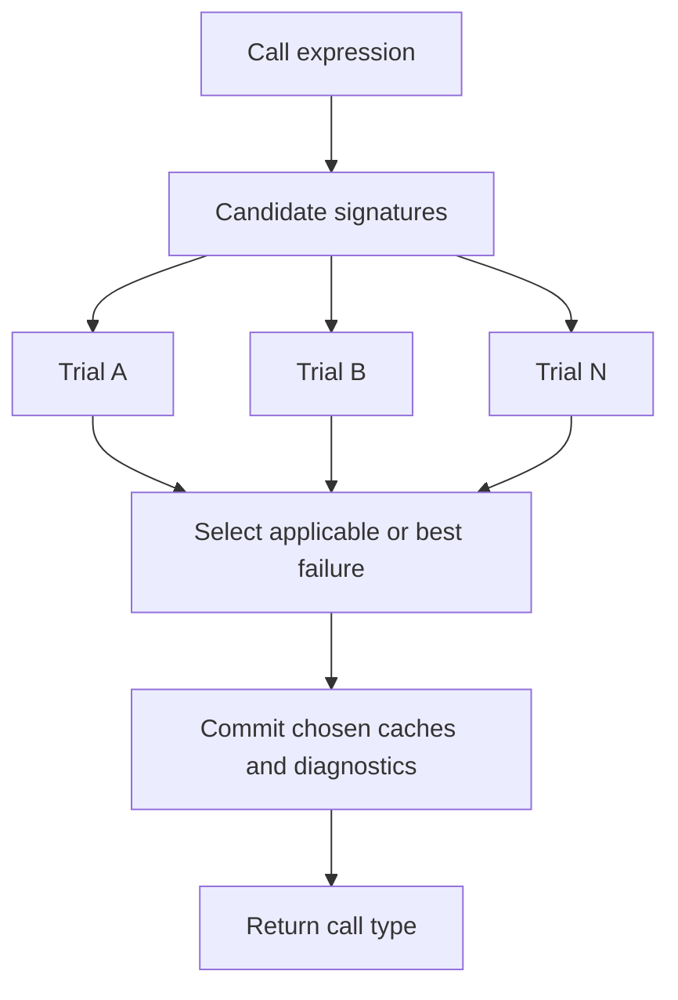

# Candidate-scoped call resolution

This note is the design guardrail for the `TS2345` / `TS2769` /
`TS2349` workstream. The goal is to stop treating those diagnostics as
isolated call-site bugs and move toward a candidate-scoped call
resolution model, so each local fix also reduces architectural debt.

Related background:

- `checker-key-functions.md` §2-3 for inference and overload porting
  notes.
- `checker-foundations.md` §3 for contextual typing and the eager /
  deferred checking split.
- `archive/workstreams/relation-core-2.md` §B3 for the archived
  inference-quality residue that motivated this design.

## Problem

The current call path in `src/checker/calls.rs` is effective enough for
many cases, but it does too much in one pass:

1. checks the callee,
2. infers type arguments,
3. contextually checks arguments,
4. mutates expression and parameter-context caches,
5. emits diagnostics while probing candidates,
6. selects an overload or constructs a failure chain.

This makes fixes for `TS2345`, `TS2769`, `TS2554`, and `TS2349`
dangerous. A change intended to make one overload applicable can also
change contextual function body checking, cache state, or the diagnostic
that gets reported when all candidates fail.

The risky symptom is familiar now: a local change improves a focused
fixture, but `golden-check` reports unrelated `NEW_FP` / `NEW_FN` in
another call-resolution family.

## Ideal Model

Call resolution should be candidate-scoped and mostly transactional.

For a call expression and each candidate signature, build a
`CallCandidateTrial`:

- original signature id,
- instantiated signature,
- explicit type-argument result or inference result,
- arity verdict,
- contextual argument types,
- argument assignability failures,
- return type,
- diagnostics that would be emitted if this candidate is selected,
- cache writes that are allowed to commit only if selected.

The selection algorithm then chooses the winning trial or produces a
failure diagnostic from the failed trials. No candidate should permanently
mutate checker state while it is merely being tested.

## Current Implementation Gaps

### Overload trials are not isolated

`resolve_overloaded_call` in `src/checker/calls.rs` checks non-function
arguments up front, then probes candidate signatures. Function-like
arguments are rechecked per candidate, but this still shares:

- expression type caches,
- `param_ctx_types`,
- `checked_decls`,
- diagnostics side effects that must be suppressed or replayed.

This is why candidate ordering and cache arrival order can become
observable.

### Explicit overload type arguments are incomplete

The overload path currently carries `_type_args` through the signature
selection API but does not fully apply explicit type arguments per
candidate before applicability. This is a clear correctness seam for
`TS2345`, `TS2558`, and `TS2769`.

### Function-like arguments are deferred with ad hoc cache repair

The implementation intentionally drops expression caches for
context-sensitive arguments after inference, then rechecks them against
the final parameter type. This works for many cases but is a fragile
replacement for a real eager/deferred model:

- candidate trials can still see provisional contextual types,
- nested object literals need recursive cache dropping,
- function bodies may stay in `checked_decls` and avoid duplicate
diagnostics, which also risks missing changed body diagnostics.

### Spread argument checking is shallow

The single-signature path validates some tuple/rest shape, but does not
fully expand spread arguments into parameter slots for assignability and
candidate ranking. This blocks many `TS2345` / `TS2554` tuple and rest
parameter cases.

### Callable union synthesis is too narrow

`check_call_like` has a useful single-signature union synthesis path, but
the full TypeScript rule is broader:

- If every union constituent has call signatures, and the sets of
  signatures are identical ignoring return types, the union has those
  signatures with unioned return types.
- Mismatched parameter lists, optionality, rest shape, `this` parameters,
  and generic signatures must remain non-callable or route to the right
  diagnostic.

This area is especially dangerous to patch locally. A naive overload-set
synthesis can turn expected `TS2349` into duplicate `TS2322`/`TS2345`, as
seen when probing `unionTypeCallSignatures*`.

### Inference shortcuts are still pragmatic

`src/checker/infer.rs` approximates parts of TypeScript's
`getInferredType` behavior. The known risky shortcuts include:

- literal widening depending too much on current candidate freshness,
- fewer inference priority levels than tsc,
- covariant callback-parameter inference shortcuts,
- constraint clamping that can hide later `TS2345` failures.

These should not be changed until call candidates are isolated enough to
explain regressions.

## Dangerous Fix Patterns

Avoid these while working on `TS2345` / `TS2769` / `TS2349`:

- selecting a later overload by suppressing a diagnostic from an earlier
  one,
- broadening callable-union synthesis without proving signature-set
  identity,
- using `any` as a fallback for failed argument or spread matching,
- checking function-expression bodies multiple times to force the desired
  parameter context,
- changing inference widening based only on one fixture,
- emitting diagnostics during speculative candidate probing.

If a change improves a focused fixture but produces unrelated `NEW_FP` or
`NEW_FN`, treat that as evidence that a trial boundary is missing.

## Milestone Plan

### Milestone 0: Fixture Buckets

Before changing behavior, keep focused fixture lists for these buckets:

- explicit generic overloads,
- arity-only overload failures,
- contextual arrow/function arguments,
- object-literal callback arguments,
- tuple/rest spread calls,
- callable union single-signature cases,
- callable union overload-set cases,
- construct overloads.

Every milestone below should run focused fixtures plus
`./verify.sh golden-check`.

### Milestone 1: Trial Shell With No Behavior Change

Introduce a lightweight internal trial object around the current
single-signature and overload paths. Initially it should reproduce the
current behavior exactly.

The only intended change is structural:

- capture arity result,
- capture inferred mapper,
- capture instantiated parameter types,
- capture argument errors in a temporary buffer,
- commit exactly the same final diagnostics as today.

This gives future work a place to move side effects out of candidate
probing.

### Milestone 2: Explicit Type Arguments Per Candidate

Apply explicit type arguments before overload applicability checks.

Keep the first implementation narrow:

- only fixed-arity type parameter lists,
- preserve current diagnostics if explicit arity mismatches,
- avoid changing overload ranking.

Primary risk: changing `TS2558` vs `TS2345` vs `TS2769` classification.

### Milestone 3: Spread Expansion for Single Signatures

Implement parameter-slot expansion for tuple spreads in the
single-signature path, then reuse that helper in overload trials.

Do not change overload selection yet.

Primary fixtures:

- spread in function calls,
- tuple rest parameters,
- readonly tuple spreads,
- optional tuple elements.

### Milestone 4: Candidate-local Contextual Typing

Move contextual typing of function and object-literal arguments into the
candidate trial.

Candidate trial must:

- provide parameter context to function-like arguments,
- avoid committing expression caches while probing,
- avoid permanently mutating `param_ctx_types`,
- replay or commit only the selected candidate's effects.

This is the big unlock for many `TS2345` and `TS2769` cases.

### Milestone 5: Callable Union Signature Sets

Rework callable-union synthesis using the same signature matching helper
as overload trials.

Rules:

- single-signature union behavior stays compatible with current output,
- overload-set synthesis only when each constituent has the same number of
  signatures and each signature matches ignoring return type,
- generic, rest, optional, and `this` signatures must be explicitly
  handled or rejected,
- return types are unioned only after the parameter-side match succeeds.

This should be gated by `unionTypeCallSignatures*.ts`.

### Milestone 6: Inference Fidelity

Only after candidate isolation, port more of tsc's `getInferredType`:

- literal widening rule,
- top-level return-position type parameter detection,
- additional inference priorities only when probes require them,
- better common-supertype selection.

Primary risk: inference changes can flip `TS2322`, `TS2345`, and
`TS2769` simultaneously.

## Immediate Work Rule

Until the trial shell exists, prefer fixes that are:

- narrow,
- focused on a single already-understood helper,
- proven by focused fixture buckets,
- `NEW_FP 0 / NEW_FN 0` on full `golden-check`.

Do not continue adding broad local patches to overload resolution just to
reduce `TS2349` count. That work should happen inside the candidate
trial architecture.
