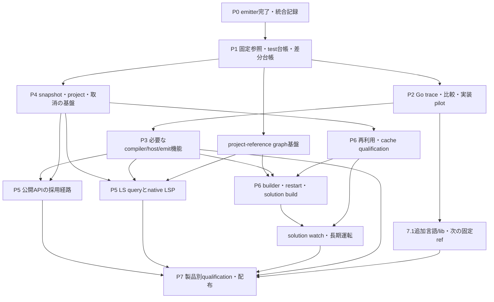

# Emitter完成後のロードマップと実装スライス

作成日：2026-09-17。棚卸しのRust参照：main
`3b1f5fe87fd31e3b303bb44bd257342735452ed9`（PR #559統合後）。
状態：**後続の設計計画**。emitter完成を宣言する文書でも、全行をruntime-readyにするpacketでもない。
最初の実行候補は[移行基盤batchの依頼案](slices/post-emitter-foundation-batch/README.md)。

**7.1の固定sourceを設計・比較の起点にし、既存機能の不足から実装する。まず追従の仕組みを
一件の実装まで通し、その基盤でcompiler、公開API、native LSP、build/watchを進める。**
必要な7.1 API・基盤は先行するが、追加言語機能・libを一括して最初の到達条件にはしない。

本書は[残作業台帳](remaining-completion-slices.md)のIDを使い、emitter後の開始順・
小さな終了条件・batchの境界を具体化する。従来の製品単位の大きな依存は、本書の子スライスで
着手条件と製品全体のqualificationを分ける。凍結済みの証拠、既存packet、accepted profileは保存する。
[TS7方針](typescript-7-direction.md)、[追従設計](typescript-7-upstream-sync.md)、
[現在のemitter依頼](slices/emitter-final-batch/README.md)を前提とする。

## 1. 参照と製品の境界

| 判断 | この計画での扱い |
| --- | --- |
| emitterの一区切り | 通常compiler emitterの依頼・必要な追加producer・統合・qualificationで閉じる。以下のAPI/LSP/build/watchを追加条件にしない |
| 参照version | 7.1の特定commitと、それに対応するtests/libs/client/toolchainを固定。7.0以前の不足をその仕様へ対応付ける |
| 現行互換性 | accepted profileは6.0.3。調査pinと製品採用pinを別管理し、移行表と証拠をそろえて製品・観測群ごとに移行する |
| Go移植 | 実際にGoを実行し、分岐・状態・消費先まで確認する。稼働中のRustをGoの形へそろえるだけの書換えはしない |
| 公開API | 非同期JSON-RPC2.0を最初のclient経路にする。同期MessagePackは独立した互換範囲として後続に実装・検証する |
| LSP | Goのnative LSPと内部LSを参照。公開Language Service APIの全完成、legacy tsserver互換、JSの旧factory API全再現を開始条件にしない |
| 上流で部分実装 | 動作が確定した独立部分のみ採用候補にする。残条件・関連PR・再調査triggerを持ち越す。未完成仕様の穴を推測で埋めない |

参照は次の役割に固定する。以下のstatic source確認は、今回のGo実行やRust互換性の証明ではない。

| 参照 | 役割 |
| --- | --- |
| `1f70213d4922b434345f639b441681e470c7cfc1`、7.1.0-dev | [既存helper](typescript-7-workflow.md)の調査pin。最初のinventory・trace候補の起点 |
| `1e4744d68260a7cb91b62b12edc3f6a2187faaf1`、v7.0.2 | 導入時期・変更理由の比較元。7.1での成功を7.0互換と主張しない |
| `5c2f7abf1733c9148100c5c6c7dd284745120d6b` | 2026-09-17の追加API読解pin。helperへの採用・test成功は未主張 |
| [7.1計画 #63703](https://github.com/microsoft/TypeScript/issues/63703)、[API計画 #63875](https://github.com/microsoft/TypeScript/issues/63875) | 更新される調査入口。取得日時・本文hash・関連PRを保存し、実装済み範囲は固定sourceとtestsで判定 |

[7.0の公式発表](https://devblogs.microsoft.com/typescript/announcing-typescript-7-0/)ではLSPを提供し、
新しい公開APIは7.1向けとされている。公開LS APIは整備途中であり、Go内部のLS・LSPと区別する。
[Build Orchestrator API #64158](https://github.com/microsoft/TypeScript/pull/64158)も確認時はopenで、
その未確定部分はAPI側の待ち項目となる。内部builderやCLI build/watchの調査・実装を一律に止める理由にはしない。
根拠・source hash・確認範囲は[既存の調査記録](typescript-7-upstream-sync.md)に保持する。

## 2. 再利用する実装と、新たに必要な責務

| 既存の入口 | 再利用するもの | 後続で必要なもの |
| --- | --- | --- |
| `scripts/typescript7.py` | 固定Go環境、compiler/FourSlashの選択実行、実exit・baseline差分・source patchの記録 | 複数固定ref、layout adapter、test inventory、差分台帳、他のrunner、比較・slice生成 |
| `crates/compiler/src/lib.rs`、`ProgramSession` | one-shotのProgram/diagnostics/emit経路 | `run`/`emit`がsessionを消費する現境界から、持続的なsnapshot・要求単位・取消へ接続する設計 |
| `crates/compiler/src/transpile.rs` | C04のnoCheck/transpile研究経路とfocused corpus | emitter後の残差再測定、7.1差分、通常入口/APIへのadmission。旧22 knownを現在値にしない |
| `crates/checker/src/program.rs` | 既存`DocumentRegistry`、document/lease、acquire/update/release | multi-projectの世代・寿命、旧snapshotと候補snapshotの共存、解放・失敗・取消 |
| `crates/program/src/resolution_cache.rs` | C05の依存観測・正負lookup・invalidation prototype | production snapshotへの統合、他cacheとの連動、実メモリ・長期運転 |
| `crates/program/src/`のconfig/resolution/library、`crates/host/src/` | 統合済みCFG/LR、path/UTF-16/host基盤 | host/System残経路、世代間更新、project graph・overlayの責務 |
| `crates/syntax/src/incremental.rs`、既存binder/checker/emitter | syntax更新と型・出力のproducer | LSの問い合わせ、builder状態、transportへの結果変換。新しい製品ごとにcompilerを複製しない |

snapshot/projectと型付き操作を共有し、その上に公開APIとLSPを載せる。
両transportのmethod名、capability、error、callback、lifetimeの契約は別々に検証する。
新crateの名前やpublic signatureはAPI1.0/L3.0/L2.0の責務調査で確定する。
「GoのpackageごとにRust crateを作る」は前提にしない。

## 3. 到達点と依存関係

| 到達点 | 作業のまとまり | 次へ進める状態 |
| --- | --- | --- |
| P0：emitterを閉じる | 現在のClaude batch、統合担当のhosted・qualification・merge | 完了scope・最終main・残ownerが固定される |
| P1：何が不足かを追跡できる | SYNC1/2、MAP、PIN設計、API/LS/runner inventory | 上流差分、現Rust、test群、未分類・保留を同じ台帳で追える |
| P2：半自動化を一巡させる | SYNC3/4＋FEATURE-PILOT | 実在する一件の不足をGo trace→比較→slice→Rust修復→統合まで通す |
| P3：通常compilerを7.1へ移す | H2.8b/c/d/e、FEATURE、H2.9 | 採用one-shot範囲のCLI・診断・JS/d.ts/maps・option差分をqualification |
| P4：持続的な共通基盤 | L2.0/1/4a、L3-PROJ1a、必要なhost/graph | edit/query/cancel/releaseを世代付きで扱える。fresh計算でも正しさを維持 |
| P5：APIとeditorの最初の経路 | API1.1/2の採用部分、L3.1a/2a/3c、L5.1/2 | 実clientのProgram/diagnostics/emitと、editorの診断・hover・definitionを別々に実証 |
| P6：再利用・build/watch・機能拡張 | L2.2/3/4b、BLD1/W1、残API/L3/L5 | cache/restart/watchや各query familyを段階採用し、結果・寿命・資源を確認 |
| P7：継続追従と製品別リリース | 7.1追加機能、VER-CLOSE、REL、各製品qualification | 固定version・分母・残差を付けて配布。次のupstream更新も同じ手順で処理 |

P番号は到達点であり、P3全終了までP4の調査を止める番号順ではない。
P1の後は下図の依存する機能だけを待つ。製品の最終qualificationはそれぞれの全採用scopeで行う。

graph→LSはcross-projectを採用する時の依存であり、最初の単一project editor経路は待たない。
R→builderは再利用を含む製品完了条件。builder runner・状態設計・fresh対照は先に作れる。
7.1追加機能と各製品の配布は採用scopeに応じて進める。図の合流は一つの巨大releaseまで
全製品を止める意味ではない。

## 4. P0〜P2：最初の二つのbatch

### Batch A：参照・テスト・差分・不足一覧

依頼入口は[post-emitter-foundation-batch](slices/post-emitter-foundation-batch/README.md)。
担当案：Codexが基盤・台帳・統合を持つ。将来Claudeへ依頼する実装は、ここでownerと証拠を具体化する。

| ID | 入力と作業 | 成果物・終了条件 |
| --- | --- | --- |
| P0引継ぎ（新runtime IDなし） | emitter最終receiptとPLAN-BASE、C04/C05、known/deferredを照合 | 最終Rust SHAとscopeを記録。旧差分を修復済み／再測定要／後続ownerへ分類。実行していない行をpassにしない |
| VER1.0-SYNC1a | helperを拡張するref/layout/toolchain設計 | source・client・libs・runnerを対応付けたref manifest。ref別checkout・lock・結果保存。既存pinを上書きしない |
| VER1.0-SYNC1b | upstreamの元パスを維持して全test群をinventory | compilerの設定展開、FourSlash操作列、Go直接assertion、API client testを別型で記録。未知・重複・除外を検出 |
| VER1.0-SYNC2a | 公式Issue/PRと固定A→B差分を収集・対応付け | rename/delete/revert/baseline-only/shared dependencyを保持。未分類を残し、Issueのcloseを実装完了に変換しない |
| VER1.0-SYNC2b | 機能台帳と再調査queue | stable feature ID、導入世代、7.1の変更、依存、上流状態、Rust状態、欠けた条件・再調査trigger。再実行・checkpoint更新で未完了項目が消えない |
| VER1.0-MAP / PIN設計 | PLAN-BASEと現在RustをBのtest・仕様へ対応付け | retained/changed/removed/new/unknownの対応。既存不足・7.1基盤・追加言語/libを区別。採用profile移行案とpilot候補を作る |
| API1.0 / L3.0 / L5.0のinventory部分 | API宣言・client、内部LS、LSP、test/runnerの境界を調査 | 公開・内部・protocolの三表。最初のAPI/LSP経路に必要なmethod・producer・testを特定。サービス実装完了とは数えない |

最初から全upstream testをRustで動かす必要はない。**存在・構成・不明点の網羅的な台帳**と、
**選んだfamilyの実行・比較能力**を分ける。全testをplain compiler入力へ潰すこともしない。
互換性を測るfamilyごとにrunner adapterを増やす。

### Batch B：Go trace・比較・slice生成・実装pilot

| ID | 入力と作業 | 成果物・終了条件 |
| --- | --- | --- |
| VER1.0-SYNC3a | compilerを最初のfamilyにしてA/B/Rustの観測driverを接続 | 同一test意味・全設定を揃えた比較。旧版非対応、upstream未完成、skip、missing baseline、Rust未対応、実差を別状態にする |
| VER1.0-SYNC3b | branchを通るGo probeと詳細trace | 呼出し、入力、分岐、state変更、消費先、outputへの因果を記録。source patch、probe、toolchain、入力hashを保存。非instrumented実行でも結果一致 |
| VER1.0-SYNC4 | 対象test＋対照＋隣接回帰とownerからpacket案を生成 | Go責務↔Rust責務、依存、変更範囲、before、終了条件、ローカル/hosted案。未解決項目を含む案はdesignに留め、生成だけでreadyにしない |
| VER1.0-PINのpilot採用部分 | pilotが依存するsource/client/libs/runnerと観測範囲を確定 | 6.0.3との差・保持する回帰・7.1への移行対象を明記し、必要なreadinessを満たしてからruntimeへ接続。製品全体のpin移行完了とは区別 |
| VER1.0-FEATURE-PILOT | emitter後も残る、再現可能な既存機能の不足を一件移植 | 必要なGo責務のRust実装、focused before/after、対照、合成回帰、hosted・統合・採用記録まで完了 |

pilotの第一候補は、既存研究資産があるH2.8cのnoCheck/transpile関連、またはH2.8dのemit要求境界。
これは不足を確認した指定ではない。Batch Aで実差・上流の完成範囲・独立性を確認して一件を選ぶ。
既に修復済みなら別の実差へ替え、pilotを作るために不要な実装を追加しない。
APIやFourSlash全対応を先に作らないと比較できない機能は、最初のpilotから外す。

**半自動化の最初の完成条件はBatch Bの統合まで。** Issue→詳細仕様→固定差分→test選定→
Go実行trace/比較→slice案→必要なRust実装という7工程の全てに、実例と再実行記録があること。
収集・hash・差分・候補抽出・比較・依頼案の組立てを自動化し、仕様判断・原因判定・採用判断・
reviewを人/agentが担う。全機能の無人自動移植はこの到達点に含めない。

## 5. P3：既存機能の不足と通常compilerの移行

ここからはMAPが確定した不足を優先する。元台帳の全項目を再実装する指示ではない。
Go参照は`tsc/internal/compiler`、`transpile`、`execute`と対応runnerを起点とし、
実装packetでは当該commitの具体的なsymbolとtestへ絞る。

| 推奨batch / ID | 実装範囲 | 比較・終了条件 |
| --- | --- | --- |
| C-ENV：H2.8b-LR3/HOST1/SYS1 | root/library membership、optional host/fallback、read/decode/write/BOM/faultの残経路 | path/bytes・呼出し順・diagnostics/exit・失敗境界。既存CFG/LRを保持し、通常CLIと後続snapshotに必要な最小部分から進める |
| C-TRANSPILE：H2.8c-NC1/MOD1/TM1/TD1 | C04の通常入口への接続、noCheck、isolated/verbatim条件、transpile JS/d.ts | emitter後の再測定＋7.1比較。diagnostics、JS/d.ts/maps、emitSkipped、既定optionsと不正入力。旧6.0.3期待値を無条件に7.1へコピーしない |
| C-EMIT：H2.8d-SEL1/MODE1/WRITE1/CANCEL1 | targeted emit、mode組合せ、request/host callback、取消と次回呼出し | 出してはいけないfileの不在、partial write、error順序、callback優先、再利用時fresh equality。API/LSのper-file出力に接続 |
| C-CLI：H2.8e-ARGS1/INFO1/INIT1/SHOW1/LIST1/OBS1/TERM1 | mode dispatch、help/version/init/showConfig/list系、診断・TTY・測定表示 | 採用CLI分岐ごとのstdout/stderr/exit・FS効果。非決定的時間値は測定契約を分離。build/watchはそれぞれのownerへ |
| C-GAPS：VER1.0-FEATURE-* / H2.9-RES-* | MAPで見つかったparser/binder/checker/resolver/emit/libの既存不足・必要な7.1変更 | 原因ownerごとの固定testとGo trace。同じownerの差をH2.9専用の迂回処理で直さない |
| C-CLOSE：各H2.8-CLOSE、H2.9、VER1.0-CLOSEのcompiler部分 | 採用したcompiler/conformance/transpile/CLI範囲を合成 | 分母・known・未採用・intentional deltaを固定。source/client/libs/generated data/version表示と採用profileを一致させる |

C-ENVの全終了を待たず、必要なhost観測が閉じたC-TRANSPILEやC-EMITの子を進められる。
C-CLOSEをAPI/LSPの調査や限定経路の唯一の入口にしない。ただし依存するchecker/host/emitの
不足を未解決のまま「API/LSP互換」と数えることはできない。

## 6. P4：snapshot・projectと再利用の共通基盤

L2.4を以下の二つに分ける。これは全L2.4の完了条件を弱める変更ではなく、正しさの基盤と
最適化を含む製品qualificationの実装順を分けるもの。初期の限定経路はfresh計算でよいが、
遅延・メモリの制約と未採用のreuseを明記する。

| ID | 具体化する責務 | 終了条件・後続 |
| --- | --- | --- |
| L2.0 | immutable/mutable state、document/Program/host/cacheの所有者、multi-generation runner | open/edit/close、option/root/config/package変更、取消と失敗にfresh対照。現`ProgramSession`からの接続設計 |
| L2.1 | 既存registry/leaseのmulti-project拡張、script-kind/options variants、寿命 | 二世代共存・共有document・release・失敗時lease回収。identityと参照数の観測を確定 |
| L2.4a（新子） | 候補snapshot作成、atomic publication、旧世代保持、取消・stale破棄 | 古い要求を古いsnapshotで完了でき、未完成候補が見えず、新publish後に旧leaseを解放。fresh経路でまず証明 |
| L3-PROJ1a（新子） | 単一configured/inferred project、open-file overlay、config発見、UTF-16 edit、close | open→diagnostics/query→edit→query→closeを比較。設定・overlayの優先順位と世代が一致 |
| L3-PROJ1b（新子） | 複数project、external projectの採用判定、参照graph、再選択・解放 | cross-project scopeと寿命を比較。graph部分はBLD1.3a-Gを共有し、solution build完了待ちにしない |
| L2.2 | Programのup-to-date/reuse、root/options/import/lib/package/reference差分 | 毎世代fresh結果と一致。reuse状態とparse/bind/check回数を別観測にする |
| L2.3a/b | C05をproductionへ接続し、config/lib/package/dir/failed lookupを統合 | positive/negative invalidation、path/mode identity、取消時候補破棄、隣接cache更新を比較 |
| L2.4b（新子） | 以上の合成、長期edit/churn、resource qualification | fresh equality＋定義したcache/lease/RSS上限。初期のfresh-only成功をreuse完了へ転用しない |

最初のAPI/LSP限定経路はL2.4aと必要なproject scopeから開始する。
大きなworkspace・auto-import cache・incremental builderの製品完了にはL2.2/3/4bが必要。
Goの主参照は`tsc/internal/project/{session,snapshot,overlayfs,projectcollection,refcountcache}.go`
など。実際のRust配置とGo所有権との差はL2.0で明文化する。

## 7. P5：公開APIとnative LSPを小さく通す

### 公開API

| ID / 順序 | 範囲 | 最初に必要な証拠 |
| --- | --- | --- |
| API1.0残部 | 固定pinのmethod/params/result/error、transport/client、handle/callback/取消契約の詳細 | `tsc/internal/api`・`ipc`と`packages/typescript/src/api`・client testsの対応。公開されていないLS methodを追加必須にしない |
| API1.1a-RPC / API1.1a-HANDLE（新子） | async JSON-RPC framing/session/error、source/node/snapshot handleとrelease | 固定upstream clientからRustへ接続。位置単位、null/optional、失効handle、切断、callback中のerrorを比較 |
| API1.1b-CORE（新子） | 採用createProgram、source取得、diagnostics/checker操作とFS callbacks | client→Rust→FS callback→結果→releaseの一巡。固定pinが要求する再入・取消・反復をtestで具体化 |
| API1.2-EMIT（新子） | APIのemit/emitToString・selected JS/d.tsのうち採用したmethod | H2.8c/dと接続。methodごとのmode/noEmit/diagnostic/write契約を区別し、名前だけで同一動作と仮定しない |
| API1.1-SYNC（新子） | 同期MessagePack client経路 | typed coreを共有し、encoding/順序/error/releaseをsync clientから別検証。asyncのpassで代用しない |
| API1.2-EXT（新子） | content mapper、transform、追加LS公開methodなどの採用部分 | 完成済みの固定契約から個別packet化。mapperはvirtual document/span/diagnostic/edit変換を横断比較。上流待ちはその子だけ保留 |

最初のAPI到達点はCORE＋必要なEMITのasync client経路。
transpileを同時採用する場合はC-TRANSPILEを依存に加える。legacy JS互換packageのAPI1.3は別の任意scope。
同期clientと拡張を後続に分けた初期profileを、全API互換と表示しない。

### Language Serviceとnative LSP

| 推奨batch / ID | 範囲 | 比較・終了条件 |
| --- | --- | --- |
| LS-BOOT：L3.0、L5.0 | native FourSlash operation runner、typed query、JSON-RPC/LSP transcript runner | compiler baselineとservice assertionを分離。query位置・順序・編集後世代を保存。LSP能力とerrorの分母を固定 |
| LS-FIRST：L3.1a、L3.3cのhover、L3.2aのdefinition、L5.1/2の対応子 | 最初のeditor経路：initialize→open→診断→hover/definition→edit→更新→close→shutdown | configured/inferredの採用scope、UTF-16/URI、取消、古い世代の結果排除。FourSlashの結果と実protocolの結果を両方確認 |
| LS-COMPLETE：L3.3a/c、L5.2b | completion/detailsとsignature help、trigger/context、display/docs | replacement span、順序、optional fields、編集直後の結果を比較。auto-importは次の子へ |
| LS-NAV：L3.2a/b/c、L5.2a | refs/type-definition/implementation、rename/file rename、symbols/hierarchy | 複数file/project、module/path/source map、workspace editの範囲・version・取消 |
| LS-EDIT：L3.1b/c、L3.4a/b/c、L5.2b/c | classification/tokens、format、fix/refactor、organize imports、inlay/paste | family内もownerごとに分割。結果だけでなくapplicability、options、変更を適用した後のsourceを比較 |
| LS-PROJECT：L3.3b、PROJ1b、L5.3 | auto-import/provider cache、background/region診断、scheduler/progress、watch/reload | L2.3/4bと必要watch hostに接続。決定的race、stale抑止、解放、package/config変更 |
| LS-CLOSE：L3.5、L5.4 | 採用全query・per-file emit・protocol・長期運転・editor相互運用 | Go LS比較、protocol比較、実editor smokeを別集計。能力を実装scopeに一致させ、latency/memory/platformをqualification |

取消・stale抑止の最低限はLS-FIRSTに含める。L5.3で初めて正しさを追加する設計にはしない。
L5.3は並行要求、background処理、progress、負荷下の取消へ拡張する。
参照は`tsc/internal/ls`、`lsp`、`project`、`fourslash/tests`。
LSPを完成させてから全LS機能を載せる大きな二段階ではなく、**LSのfamilyとLSP対応を一組で完成させる**。

## 8. P6：build/watchとAPI公開の分離

| ID | 範囲 | 終了条件 |
| --- | --- | --- |
| BLD1.0 | Goのbuilder/incremental/solution runnerと再起動oracle | `tsc/internal/execute/{build,incremental,tsc,tsctests}`など、固定pinの実test/packageをinventoryから選択。現helperに存在しないcommandを既成扱いしない |
| BLD1.3a-G（新子） | project-reference graph、config/redirect/cycle/orderの共通部分 | H2.8b/L2.0から先行可能。L3-PROJ1bと共有。incremental status/build-infoに依存する部分はここで完了としない |
| BLD1.1 | affected files、signature/dependency、unchanged write、pull/done | fresh full buildと出力・診断が等価。処理順・取消・failure continuationと再利用を観測 |
| BLD1.2 | build-info schema/version、incremental CLI、保存/再起動/破損 | 同processだけでなく別process再開、partial I/O、version mismatch、修復後を比較 |
| BLD1.3a-S / 3b（新子/既存） | graph上のup-to-date status、solution build、clean/dry/force/verbose | graph基盤＋BLD1.2。timestamp-only work・partial graph・failure/exitを比較 |
| W1.0 / W1.1 | 仮想時計、registration/coalescing/close、単一project watch | sleepに依存しないevent比較。root/config/package/missing/type-root変化、再診断・出力、解除を検証 |
| W1.2 / W1.3、BLD1.4 | solution watch、cross-project invalidation、長期・fault・platform | graph更新・error回復・close・資源上限。OS実watchは決定的core testとは別にqualification |

watchのhost部品はLSPの必要範囲から先に使える。完全なsolution watchはLSP単一project経路の前提ではない。
BuildOrchestrator公開APIはAPI1.0/2の別採用項目とし、PR #64158等の完成範囲を再調査して接続する。
CLI build/watchのGo責務をRustへ移す時点で、未確定の公開API全体を固定しない。

## 9. P7：7.1追加機能、継続追従、配布

VER1.1-TRACKはP1から動かし、実装は必要な基盤と既存不足を優先する。
#63703のtype import attributes、source-phase imports、ES2026/lib・DOM等は、計画の見出しを
そのまま一つの実装sliceにせず、source/testでparser・checker・resolution・emit・libの依存へ分ける。
小さなlib更新でもgenerated data、diagnostics、対応するruntime/target前提を確認する。
特定機能がAPI/LSPの前提なら先行させ、それ以外はcompiler/API/LSの近接ownerとbatch化する。

更新処理は次の状態を維持する。

1. A/Bの固定SHA、Issue/PRの更新、test/lib/client/runner差分を記録する。
2. 全変更に分類を付け、未分類・未取得を残す。renameやbaseline削除を成功数へ変換しない。
3. 上流状態（提案/部分実装/対象scope実装済み/revert等）とRust状態（未調査/設計/実装候補/統合/qualified）を別々に更新する。
4. 対象testと共有producerの回帰を選び、Go traceを必要な分岐で取り直す。失敗の原因が上流・harness・Rustのどこかを記録する。
5. 独立部分の採用、依存基盤の先行実装、上流待ちのいずれかに割り当て、残条件と次のtriggerを保存する。
6. 新checkpoint後も未完了feature ID・証拠・依存を保持する。採用済み仕様にrevertがあれば再調査し、古い成功を持ち越さない。

配布はone-shot compiler、API client/server、native LSP、build/watchの採用範囲ごとに
VER-CLOSE、REL1.0/1/2を具体化する。必要なWindows/POSIX・locale・package/installの観測を付ける。
旧M9の6.0.3 batch、連続14 UTC windowsという契約は凍結保存し、7.1やLSPの信頼性へ転用しない。
7.1の長期confidenceを採用する際は別のdomain/producer/qualificationを定義する。
Functional CI frameworkの再開はこの計画の必須前提にしない。

## 10. 依頼・実装・統合の共通ルール

各行を実装へ渡す時は、次を持つ子packetへ具体化する。調査で差がなかった項目は根拠付きで閉じる。

- Rust base/head、upstream A/B完全SHA、source/client/test/lib/runner/toolchainのidentity。
- 問題を起こす入力条件、Goの宣言・body・trace、Rust owner、変更する共有境界。
- exact test/configuration/operation IDsと全observables。positive/negative/fault/cancelは契約に必要なものを選ぶ。
- immutable before、実装後のafter、隣接回帰、known/未実行/上流待ちの扱い。
- focusedローカルcommandと期待件数、hosted入口・資源上限、必要なreadiness/admission変更。
- 最終候補での合成結果、PR/run/head/exit/hash、merge後同一tree、architectureと台帳の更新。

担当は、Codexが参照/runner/CI/台帳と統合を持ち、Claudeには原因と境界が確定した
移植・修復を複数まとめて渡す案とする。共有snapshot/host/API境界を同時に別設計へ変更しないよう、
先にinterfaceと変更fileの所有者を決める。準備ができたsliceはまとめて検証するが、commitと証拠は原因別に保持する。

[witness方針](../../witness-testing.md)に従い、focused local→互換な複数sliceの合成→selected hostedとする。
ローカルは2 workers・macOS background、一度に重い処理を一つ。full localを通常ループへ戻さない。
[最新CI記録](slices/witness-coverage/emitter-final-ci-budget/README.md)ではcontrols25m21s、
module-output20m42s、replay最長28m25s。これは現在のjobの測定であり、将来LS/build分の余裕の保証ではない。
新familyは観測の分母を保持した専用入口へ追加し、45分で分割を検討、60分をhard limitとする。
wall timeだけでなく全jobのbuild/実行総量も確認する。zero-selected・skip-only・baseline欠測をgreenにしない。

最初の見積り更新はP1の台帳とP2のpilot後に行う。現在は不足の総数も、将来全familyの実行時間も未測定。
旧15,642 IDsや6,045残差ID、C04の旧known件数を新しい不具合数として足し合わせない。
各到達点で残ownerと実測を更新し、日数より先に次の実装可能なbatchを確定する。

## 11. 本計画で確定したことと、実装前に残る判断

この計画で、参照versionと実装優先順位、最初の二batch、snapshotの先行境界、API/LSP/buildの
依存関係、製品別終了条件を整理した。runtime source、helper pin、accepted profileは変更していない。
今回行ったのは既存資料・Rust source・固定Go source構成・公式roadmapの調査であり、新たなGo traceや互換test実行ではない。

実装前に解く事項は、emitter最終SHAでの差分再測定、製品採用7.1 pin、最初のpilot、
test familyごとの正確な件数・観測schema、最小API/LSP method集合、profile/readinessの具体的な変更である。
これらをBatch A/Bの成果物として解決する。公開LS APIの未完成を理由に全体を待機させず、
固定できた責務を順次Rustへ移していく。
