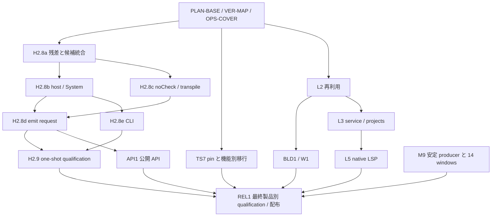

# 残タスクと完了までのスライス設計

更新日：2026-09-17。対象：one-shot compiler、TypeScript 7 移行、再利用、build/watch、
公開 API、Language Service、native LSP、最終検証・配布。
実装の確認点は SUPER 統合済み main `d671d8417` と CI 改修 `dac0d55ce`。
CI 改修も main `bb2d51c89` にマージ済み。

本書は [実行 schedule](post-h1-completion-slices.md) の現在の棚卸しと担当分割です。
凍結済みの profile、ratchet、readiness manifest を書き換えるものではありません。
**Claude は下記の C01〜C05、T1、追加の POST-T1 5子スライスの候補。それ以外の行は Codex／統合担当が持ちます。**
候補の提出、main への統合、製品の qualification は別の完了条件です。

**2026-09-17のユーザー指定：emitterが完成した時点を次の一区切りとする。**
直近はemitter残差の修復・必要な検証・統合を優先する。LSP関連と一般的な公開API整備は、
作業量の大きい別フェーズとして後で扱い、emitter完了の条件へ追加しない。
後続LSP/APIは[TypeScript 7のGo実装と公開通信仕様](typescript-7-direction.md#emitter-milestone-and-subsequent-api-work-2026-09-17-clarification)に合わせてRustへ移植する。固定参照ではLSP／非同期APIがJSON-RPC、同期APIがMessagePackであり、それぞれの互換性を分けて検証する。
以下は長期の残項目も含む台帳であり、全行を今回の一区切りまでに実施するという意味ではない。

2026-09-15：**[PLAN-BASE の台帳作成](slices/plan-base/README.md)は完了**。
全15,642 corpus IDを照合し、6,045 ID・9,004所属の残差／検証記録台帳を作成した。
旧 class 128失敗のうち88件は同じ fixture で現在の hosted が exact、40件は未再測定。
旧 global 14件には後続修復記録7件があり、最新 main の全件失敗数とは区別する。
新規 Rust replay は行わず、次は VER1.0-MAP と必要な OPS-COVER の対象をこの台帳から選ぶ。

## 1. 現在地と、残タスクに戻さないもの

| 項目 | 確認できた状態 | 今後の扱い |
| --- | --- | --- |
| M0〜M8、H0、L0/L1、H1 | それぞれの凍結された範囲で完了 | M9、広い emit、old-Program、LSP の完了を意味しない。基盤を作り直さない |
| H2.1〜H2.5g、H2.7b〜e | schedule の qualified / complete 記録あり | 共有 producer を変更した場合の回帰対象 |
| H2.5h、H2.6a〜c | 実装済みだが shrink-only の既知差分が残る | 下記 A-RES / VER-MAP で個別に解消・移行 |
| UTF-16 の値・template flags、generated binding | `JsString` / `TargetBinding` は main に導入済み | C01/C02 は残経路監査。全面再実装を依頼しない |
| A41-SUPER after-18 | [PR #523](https://github.com/kazhiramatsu/tsc-rs/pull/523) で統合済み。primary 670、controls 408、retained 530 が各 2 回 exact。primary の upstream 例外 2、direct の 28 exact / 4 known は別集計 | 旧「retained 53 失敗」を現状として使わない。8 patch と receipt は凍結保存 |
| G5c / parameter | [PR #522 の統合記録](slices/h2-8a-g5c-parameter-integration.md)。G5c と ES5 parameter 4 行を修復 | ES2015 parameter/comment の5差分は [A-PC1 / PR #538](slices/h2-8a-compact-body-comments.md)で解消。元68 commandsが完全一致×2 |
| declaration module specifier | [DECL-SPEC1](slices/h2-8a-declaration-specifiers-report.md)：focused 30＋元の monorepo 1 command が各 2 回一致 | 全 declaration/specifier 組合せの完了と混同しない |
| H2.8b-LR1 / H2.8b-LR2 | [library order](slices/h2-8b-library-order-report.md)：18 complete commands と順序観測が各 2 回一致 | 任意の非 library root と library membership が交差する残経路は B-LR3 |
| H2.8b-CFG1a〜g | [config completion](slices/h2-8b-config-completion-report.md)：conversion / extends / provenance / cache / discovery / option metadata の bounded scope は完了 | HOST/SYS、世代をまたぐ invalidation、B 全体の admission は未完了 |
| TypeScript 7 native workflow | [固定 pin の compiler / FourSlash 入口](typescript-7-workflow.md) は実装済み | feature 対応表、製品への採用、build/watch runner は別タスク |
| ローカル witness / hosted CI | [PR #524](https://github.com/kazhiramatsu/tsc-rs/pull/524)：明示 case selector、immutable lib bytes の共有、acceptance 3 分割、変更範囲による選択 | 手順は [witness-testing](../../witness-testing.md)。全 legacy CI や全 witness のローカル再走を通常ループに戻さない |

### 現在の数と、再確認が必要な数

- 現在の manifest は H2.5h **12**、H2.6a **1**、H2.6c **8** 行。
  6a/6c の同一 source-map case が重複するため **21 所属・20 unique IDs**。
  これは既知差分リストの件数であり、全残タスク数や未実装 owner 数ではない。
- H2.8a global の **769 中 755 exact / 14 failed** は A6-37
  `d1c04df5c` の履歴。class の **1228 中 128 failed** も A6-34 の履歴。
  後続修復を含む現在の全体失敗数は未計測。今回は棚卸しのための全件 replay をしていない。
- `h2-8a-convergence-causes.v1.json` の G1〜G8 や、古い UTF-16 review の
  must-fix は、後続の修復・review response と突き合わせる。古い `open` を転記しない。
- 統合時の emitter Clippy は base と同じ **16 指摘**。依存込みの実行は既存 program
  指摘でも止まる。Claude 単独候補の lint green を現在の workspace 全体へ引き継がない。

さらに [PR #524 の acceptance](https://github.com/kazhiramatsu/tsc-rs/actions/runs/34967807268)
には、既知差分以外の **later-owned / deferred** がある。主要な現行出力は次のとおり。

| 集合 | 現在の実行結果 | 棚卸し先 |
| --- | --- | --- |
| H2.1〜4 | slice ごとに source-deferred を保持。H2.3d は admitted candidates 0、future-deferred 695 | 全 source/future-deferred を PLAN-BASE で後続 admission と照合。695 を新規不具合数にしない |
| H2.5g | 9027 candidates、8511 exact、H2.8a deferred 6、H2.9 deferred 510 | A-RES と H2.9-INV |
| H2.5h | 932 candidates、876 exact、known 12、deferred 44 | A-RES / VER-MAP / 各 later owner |
| H2.6a / b / c | a: 174 exact / known 1 / deferred 2。b: 6 exact。c: 631 exact / known 8 / deferred 4 | A-RES、transpile 等の明示 owner。c の current refusal は isolatedModules と useCaseSensitiveFileNames |
| H2.7b | 1593 candidates、1557 exact、deferred 36 | H2.9-INV と各 artifact/option owner |
| H2.7c | 42 candidates、32 exact、deferred 10 | targeted / mode 等の後続 owner。旧 close 時の 31/11 を現在値にしない |
| H2.7d/e＋directory | D283＋E-only8＋directory23＝314 exact、11 later references。D-only の中間出力 reference 32 は最終残数ではない | PLAN-BASE で23 directory移行を ID ごとに照合済み。残りの入力・観測を H2.9-INV と各 owner へ |

上表・旧 global/class・known manifests は重複する。**表の数を足して残件数にしない**。
既に別の profile で exact になった保留行もあるため、PLAN-BASE で case / observation / version /
admission owner の対応を作る。H2.9 は大規模テストだけで終わるとは限らず、未対応 producer が
残れば H2.9-RES の子スライスで実装する。

根拠は上表の報告、[H2.8a 履歴](slices/h2-8a-global-output.md)、
[現在の emitter architecture](emitter-architecture.md)、
[L0/L1 の accepted record](lsp-and-incremental.md)、main の source と既知差分 manifest。
CFG の統合観測は `ratchets/h2-8b-config-integrated-*.v1.json` にも残る。
古い [B〜E design registry](slices/h2-8b-e-design-registry.v1.json) の 24 行は設計時点の
記録として保存し、LR/CFG を再び未実装にしない。

## 2. 担当と開始順

### Claude の当初5件、T1、POST-T1一括依頼

依頼入口は [Claude handoff index](slices/claude-high-difficulty-handoffs.md)。
**C01/C03/C04 は候補を受領済み。C01は[統合記録](slices/h2-8a-literal-update/integration/README.md)でPR #542の統合完了を記録。C04 は[統合記録](slices/h2-8c-transpile/INTEGRATION.md)を参照。C02修正版も受領し、[再レビュー・統合候補](slices/h2-8a-generated-binding/integration/revised/README.md)でF1/F2確認と追加temp ordinal修復・CI登録を記録。PR #549の全13 checks成功後、main `84da0c027` へ統合済み**。
C05は再提出を受領し、R4の残る2件とR1のpath表記衝突を統合側で修正し、PR #539で統合した[prototype](slices/l2-3-resolution-cache/integration/README.md)。専用CI入口を登録し、fresh178/native190と回帰を確認。全7 hosted jobと両gateが成功し、mergeと実測は同記録に保存した。Program本番統合はL2.3a/bへ残す。
[C03 統合レビュー](slices/h2-8a-printer-failure/INTEGRATION.md)に44 exact / 2保留、
追加修復・検証・hosted 入口を記録した。その後の [A-INT3-CS](slices/h2-8a-printer-comment-carry/README.md)
で source をまたぐコメント差を修復し、PR #528 で統合済み。提出25件の残差は C02 / A-INT2 の生成名1件。
追加対照で観測した hook hint 4件は統合担当 [API1.2-HINT](slices/api1-2-printer-hook-hints.md)で修復・PR #537で統合済み。全hosted jobと両gateが成功。
当初の依頼表は以下に保持する。追加T1の対象5件と開始点は専用handoffに従う。

| ID / 対応 owner | 依頼内容・境界 | 開始条件 | Claude 側の完了条件 / 統合先 |
| --- | --- | --- | --- |
| C01 / A40-LITERAL-UPDATE | [リテラル更新・伝播](slices/h2-8a-literal-update-claude-handoff.md)。値更新時の raw/quote/text-source/flags、clone/update の残経路監査と再現した差の候補修復 | SUPER・UTF-16 導入済み main。既存観測との対応表から開始 | 全要求を既存 exact / 対照不足 / 再現差 / 未到達に分類。新規対照・focused before/after・patch。差がなければ根拠つき監査完了、不要な変更を作らない。A-INT1 へ |
| C02 / A41-BINDING | [生成名と binding](slices/h2-8a-generated-binding-claude-handoff.md)。global/synthetic/nested、computed name、lifecycle の残経路 | `TargetBinding` と SUPER helper order を含む main。旧 patch を再適用しない | 生成名の意味・identity・衝突・再実行を観測。差の候補と回帰集合、または根拠つき差なし。A-INT2 へ |
| C03 / A40-PRINT-FAILURE | [printer の失敗時状態](slices/h2-8a-printer-failure-claude-handoff.md)。observer、失敗順序、継続・再利用状態、必要な隔離修復 | 現行 writer/printer API。A-PC1 の parameter/comment 差分は隣接 owner として照合し、別原因なら同乗させない | upstream の partial writes / error / 次回呼出しを比較。失敗注入点・状態境界・focused 候補を提出。A-INT3 へ |
| C04 / H2.8c | [noCheck / transpile](slices/h2-8c-transpile-claude-handoff.md)。noCheck、transpileModule、transpileDeclaration の依存設計、source oracle、隔離 prototype | 現行 compiler/emitter と採用 version の source。共有変換・declaration を棚卸し | API ごとの complete observables、必要な linked-reference/diagnostic schedule、prototype と未到達一覧。runtime activation はせず NC1/TM1/TD1 へ |
| C05 / L2.3 | [resolution cache](slices/l2-3-resolution-cache-claude-handoff.md)。snapshot/dependency/invalidation 設計、実 resolver の隔離 prototype | 現行 resolver/host/path identity、固定 Go reference。L2.0 の本番統合前でも調査可 | 正・負 lookup と隣接変更で reuse/invalidation を証明。所有権・取消・寿命・cache key と patch を提出。Program 再利用への組込みは L2.3 へ |

当初5件とT1は候補統合済み。T1はPR #550のmain `eb6dc2c78`に入った。
**次は [POST-T1一括依頼](slices/h2-8a-post-t1-residuals-claude-handoff.md)**。
R9（2 complete commands）、R12（C02の2＋T1の2）、private receiver map（1）の修復候補と、
private-set / decorator のコメント制御（別集計の1＋2 packet probes）の監査・必要な修復をClaudeが持つ。
5子のownerと設計・before/afterは分け、一つの合成候補として提出する。
この一覧を新たな runtime `ready` 判定には使わない。Claude へ送信する操作は本書の作成に含めない。
提出済み SUPER は 6 件目の新規依頼に数えない。

### それ以外（Codex／統合担当）

以下の全行を統合担当が持つ。Claude の成果物を受け取っても、base 照合、共有 source の適応、
候補の合成、hosted 検証、commit / PR / merge、admission と進捗更新は統合担当の責任とする。
追加依頼 [T1](slices/h2-8a-bundle-metadata-t1-claude-handoff.md) は A-RES / H2.7d の metadata 可搬性5件を修復し、PR #550で統合した。
[POST-T1](slices/h2-8a-post-t1-residuals-claude-handoff.md)の5子も候補作成はClaude、受領・合成・hosted検証・admissionは統合担当が持つ。
将来 Claude に追加委託する場合も、対象行を分割して handoff を作り、担当表を更新する。

**2026-09-16 ユーザー指示：Codex／統合担当は、依存関係の合う複数の担当スライスを実装してから、まとめて hosted CI を実行する。**
各スライスの readiness、入力・before/after・focused ローカル検証は個別に保持し、
合成した最終 source を一つの検証対象とする。次の実装はこの単位でまとめる。
詳細は [実装のまとめ方](../../witness-testing.md#batch-implementation-before-hosted-ci) を参照。

## 3. 最初に行う整合・検証基盤のスライス

| ID | 作業と成果物 | 依存・終了条件 |
| --- | --- | --- |
| PLAN-BASE — 完了 | [固定 main `f9ef828a5` の台帳](slices/plan-base/README.md)。全 active profile の source/future/later-deferred、旧 global/class、known、parameter、direct、upstream exception と後続修復を照合 | 全15,642 corpus IDに disposition あり。再生成一致、判定境界7 tests。これは台帳の完了であり、修復・全 profile qualification の完了ではない |
| VER1.0-MAP | 固定 TS7 の tests / CHANGES と H2 残項目を retained / intentional change / removed option / new feature に分類。parser/checker/resolver/emitter/libs/CLI/service の機能分母と依存を作る | PLAN-BASE と既存 native workflow。新しい参照を選ぶ場合も commit を固定。ES5/System/UMD/Node10/Classic/AMD/outFile 等を個別に disposition。廃止予定を 6.0.3 の修復完了として数えない |
| OPS-COVER | [入口台帳・追加スライス](slices/witness-coverage/README.md)。64 standalone / 16 lib-bin の静的棚卸し完了。[OPS-COVER-2](slices/witness-coverage/emitter-direct/README.md) は emitter direct10 target・2239 row の個別選択入口を追加。[OPS-COVER-3A](slices/witness-coverage/declaration-map-cli/README.md) は E-only8 のCLI専用入口を追加。[OPS-COVER-3B](slices/witness-coverage/compiler-utf16/README.md) はUTF-16の3 targetを登録し、PR #532で統合済み（全hosted job・両gate成功）。[OPS-COVER-3C](slices/witness-coverage/compiler-literals/README.md) はliteral2 targetの入口を追加。[OPS-COVER-3D](slices/witness-coverage/compiler-declarations/README.md) はdeclaration3 target・129入力の入口を追加（PR #540で統合済み、全7 hosted job・両gate成功）。[OPS-COVER-3E](slices/witness-coverage/compiler-require-rewrite/README.md)でrequire-rewrite74専用入力を追加しC01とPR #542で統合済み。[OPS-COVER-3F/3G](slices/witness-coverage/compiler-config-prologue/README.md)でconfig/library24 test・96入力とprologue8入力の入口を追加し、PR #544で統合済み（全7 hosted job・両gate成功）。[OPS-COVER-3H/3I](slices/witness-coverage/compiler-recovery-map/README.md)でrecovery50とmap-option31専用入力・原本5 IDの2 targetを追加し、PR #545で統合済み（全7 hosted job・両gate成功）。[OPS-COVER-3J/3K](slices/witness-coverage/compiler-bundles/README.md)でbundle Programとdeclaration/mapの2 targetを登録し、PR #546で追加7 testsを含む全7 hosted replay job・両gateが成功。[OPS-COVER-3L/3M](slices/witness-coverage/compiler-declaration-maps/README.md)で宣言map出力/APIの2 target・11 testsを登録し、PR #547で統合済み（全8 hosted replay job・両gate成功、CLI比較70回一致）。[OPS-COVER-3N/3O](slices/witness-coverage/compiler-module-facets/README.md)でmodule identityと原本JavaScript bundle recorderの入口を追加し、PR #550で追加4 testsを含む全9 replay job・両gateが成功し統合済み。[OPS-COVER-4A/4B](slices/witness-coverage/foundations/README.md)でsyntax/binder/typesとhost/Programの16 targetを一括追加（PR #551で統合済み、macOS47 /Linux48 testsと全14 hosted checks成功）。72 standalone中、残る直接入口なしは7 target | 次は OPS-COVER-3残部：compiler3とfilter残部、4：その他4とlib/bin。共有helperを全targetの実行証明とせず、case重複・選択・件数・時間・失敗伝播を証明 |
| OPS-BUDGET | 追加 suite の build / oracle / replay を測定し、変更 owner ごとの job 分割を維持 | OPS-COVER と各新規 target の実測。1 job 45 分を分割検討の目安、60 分を hard limit とする。重複した build による総 runner 時間も記録。worker 増でメモリ上限を隠さない |
| OPS-DEBT | [EMPTY-SOURCE](slices/witness-coverage/compiler-config-prologue/empty-source.md)で基点のforced-empty不一致を再現・限定修復し、OPS-COVER-3F/3GとPR #544で合成検証・統合済み（全7 hosted job・両gate成功）。既存 lint・strict test failure を現行 SHA で owner ごとに確定し、独立修復 PR へ分ける | 過去の compiler contract / printer failure の記録はまず再現性を確認。base と新規退行を分離。該当 owner だけ検証し、全 workspace green が未確認ならそう記録。release の採用 gate に未処理を残さない |

OPS は各製品 slice の追加対象に追随する作業でもある。新規 LSP/build/watch を現在の
`cargo xtask acceptance` だけで検証したことにはできない。別の製品 job を設け、同じ変更選択と
時間制約を適用する。これは停止中の Functional-CI framework 全体を再開することではない。

## 4. One-shot compiler の完了スライス

### 4.1 H2.8a と既知差分

| ID | 作業と成果物 | 依存・終了条件 |
| --- | --- | --- |
| H2.8a-A-PC1 — 完了 | [短い本文のコメント owner修復](slices/h2-8a-compact-body-comments.md)、PR #538 | 既知5件を解消。元のparameter68 commandsと新規printer240 casesが完全一致×2。全7 PR jobと両gate成功。 |
| H2.8a-A-INT1 — 完了 | [C01のliteral修復と専用CI入口](slices/h2-8a-literal-update/integration/README.md)をPR #542で統合済み。OPS-COVER-3Eと一括検証し全7 hosted job・両gate成功 | C01 と現行 architecture / packet。変更がない場合も対応表を記録して閉じる。raw/UTF-16/flags の退行なし |
| H2.8a-A-INT2 — 統合済み | C02 の binding 修復・追加対照をPR #549で統合。T1/R9/R12は別ownerに保持 | C02、SUPER。helper order / default runtime name / retained の必要集合が一致 |
| H2.8a-A-INT3 | C03 の printer failure / continuation 修復を統合 | C03。INT1 と source が重なる場合は順次 rebase。失敗した呼出しと次の正常呼出しを両方比較 |
| H2.8a-A-INT3-CS | [source をまたぐ comment container の修復](slices/h2-8a-printer-comment-carry/README.md)（PR #528 で統合済み） | 元の保留1 case / 2 op と追加24 case の出力を照合。UTF-16 比較値と source-bound byte cursor を分離。新しい transformation への再利用、隣接契約、全 hosted job が成功。生成名と hook hint は別 owner のまま |
| H2.8a-A-RES | 現行台帳に残る transform / declaration / JSDoc / JSX / option / map / output 差分を最終 owner ごとに分割修復 | PLAN-BASE、VER1.0-MAP。旧 G1〜G8 をそのまま実装単位にしない。`A-RES-<owner>-<n>` ごとに分母・依存・before を固定。H2.5h/6a/6c の manifest は実証した行だけ縮小 |
| H2.8a-A-CLOSE | 全 output-path / BOM / newline / removeComments / collision / failure 軸と現行 global/class 対象を閉じる | PC1、INT1〜3、A-RES の採用行。H2.8a の適用対象を漏れなく disposition し、全件は hosted へ。範囲外を別 owner に保持し、必要な profile 更新を行う |

`A-RES` の子スライス数は現在の失敗再現で決まる。旧 14/128 から仮の不具合やパッチを作らない。
最低限、元の global ID 群、class matrix、下位 target の残差、source-map 残差、direct known controls
を照合台帳へ含める。upstream exception は互換成功にも Rust の修復件数にも加算しない。

### 4.2 H2.8b：host / System の残り

LR1/LR2 と CFG1a〜g は完了した bounded 範囲を引き継ぐ。B の新しい本番 admission は
A-CLOSE と該当 artifact の前提を確認してから行う。監査・oracle の採取は先行できる。

| ID | 作業と成果物 | 依存・終了条件 |
| --- | --- | --- |
| H2.8b-LR3 | 非 library root と library membership の交差、非 prefix 配置、未観測 host hook の library 部分を監査・修復 | LR2 と PLAN-BASE。既存 18 の順序を保ち、追加 membership / source-order / diagnostic 観測が一致 |
| H2.8b-HOST1 | optional CompilerHost capability、fallback、source/realpath/directory/config 取得と診断の優先順位 | CFG1 / LR と現行 host inventory。hook 有無・成功・失敗の組合せを complete command / direct host observer で比較 |
| H2.8b-SYS1 | Memory/Fs System の read/decode/write、encoding/BOM、I/O fault、能力差と呼出し順序 | HOST1、既存 A3 write contract。英語・現行 platform の同一観測、partial failure。全 OS 行は REL1.0 へ明記 |
| H2.8b-CLOSE | LR/CFG/HOST/SYS の合成、config/host/library profile の admission | LR3/HOST1/SYS1 と A-CLOSE。既存 CFG の exact を保存し、remaining option/refusal を C/E/L2/API に一対一で割り当てる |

### 4.3 H2.8c：noCheck / transpile

C04 の研究用 noCheck/transpile 経路と301入力の専用 witness は[PR #535で統合済み](slices/h2-8c-transpile/INTEGRATION.md)。
通常 Program の noCheck / isolatedModules / verbatimModuleSyntax guard と CLI/config activation は残る。
この bounded prototype を基に
それぞれ本番 packet を作る。custom transforms は API1.2、incremental は BLD1 に残す。

| ID | 作業と成果物 | 依存・終了条件 |
| --- | --- | --- |
| H2.8c-NC1 | noCheck の診断・linked-reference・declaration 計算の必要最小経路 | C04、適用 transform/declaration。診断の有無・順序、出力・result が一致し、full checking を呼んで見かけを合わせない |
| H2.8c-MOD1 | isolatedModules / verbatimModuleSyntax の制約、JS/declaration と diagnostic routing | NC1 と option/transform owners。typed refusal の対照を正しい実行観測へ移行 |
| H2.8c-TM1 | transpileModule の API、single-file host、built-in transforms、diagnostics / source map | C04、NC1/MOD1 の必要部分。API 戻り値と route を直接比較。架空の CLI exit を作らない |
| H2.8c-TD1 | transpileDeclaration の barebones lib、forced declaration、linked reference と診断 | C04、NC1、H2.7c。declaration API の完全な結果と fault が一致 |
| H2.8c-CLOSE | legacy wrapper を含む採用 transpile corpus、noCheck 合成、性能と API route の qualification | NC1/MOD1/TM1/TD1。固定分母の全適用行が exact。時間・メモリを full check と分けて記録 |

### 4.4 H2.8d：Program.emit の呼出し単位

| ID | 作業と成果物 | 依存・終了条件 |
| --- | --- | --- |
| H2.8d-SEL1 | target SourceFile、output unit / bundle selection | 適用 H2.6/7 と H2.8c。現在の `Unsupported(TargetedSelection)` を実観測に置換。対象外出力の不在も比較 |
| H2.8d-MODE1 | emit-only / declaration-only / noEmit と targeted 軸の組合せ | SEL1、NC1/TD1。診断・emitSkipped・write の有無を比較 |
| H2.8d-WRITE1 | request callback と host callback の優先順位、metadata、partial write | SEL1/MODE1、SYS1。先行 callback の失敗時に後続へ誤って fallback しないことも観測 |
| H2.8d-CANCEL1 | cancellation checkpoint、失敗・取消後の Program/emit 状態 | WRITE1、printer failure の state contract。部分状態を publish せず、次回結果が fresh と一致 |
| H2.8d-CLOSE | targeted / mode / callback / cancellation の全適用組合せを qualification | 上記 4 行。既存 forced-declaration や whole-Program の pass を転用しない。LS per-file emit は L3.5 でも検証 |

### 4.5 H2.8e と H2.9：CLI と broad qualification

| ID | 作業と成果物 | 依存・終了条件 |
| --- | --- | --- |
| H2.8e-ARGS1 | argv / response file / option / mode dispatch の残経路 | B-CLOSE、CLI inventory。位置・重複・不正値・response-file fault と診断順序が一致 |
| H2.8e-INFO1 | version / help / all / no-input の表示と exit | ARGS1。採用 version に一致する stdout/stderr/exit |
| H2.8e-INIT1 | init config 生成、既存 file、write fault | ARGS1、SYS1。bytes / path / error / exit が一致 |
| H2.8e-SHOW1 | showConfig、extends、path conversion、diagnostics | ARGS1、CFG1。展開結果と failure boundary が一致 |
| H2.8e-LIST1 | listFilesOnly / explainFiles / listEmittedFiles | ARGS1、LR3、emit modes。順序・理由・出力なしの経路も一致 |
| H2.8e-OBS1 | diagnostics / extended diagnostics / trace / profile | ARGS1、System。決定的な表示・イベントを比較し、実時間値は別の測定契約で扱う |
| H2.8e-TERM1 | English locale 検証・fallback、pretty/TTY、stdout/stderr と terminal capability | INFO1/OBS1、SYS1。英語 profile を閉じ、追加 locale は REL1.0 に残す |
| H2.8e-CLOSE | 全 one-shot CLI 分岐と option converse inventory の照合 | ARGS1〜TERM1。build/watch 分岐は BLD1/W1 に明示し、未実装成功を残さない |
| H2.9-INV | 全 compiler / conformance / project / transpile 分母と、全先行 profile の deferred/reference を照合 | PLAN-BASE、VER-MAP。既存 admission との重複・未観測軸・未対応 producer を全件 disposition。H2.8a〜e 待ちにせず調査可 |
| H2.9-RES-* | INV で残った採用対象の producer / runner / option の差を owner ごとに実装・修復 | H2.9-INV と各 producer の前提。A〜E/BLD/API に既存 owner があればそこへ戻し、孤立した後付け処理にしない。各子 slice に exact before/after |
| H2.9 | compiler / conformance / project / transpile の採用全観測、resource と release candidate の qualification | H2.8a〜e、H2.9-RES、採用した version 差分。suite/観測別の分母を保持して hosted 分割。既知差分を隠す normalization や profile 間の pass 借用なし |

## 5. 再利用・build・watch（すべて統合担当）

L0/L1 の immutable document、lease、incremental parser は既存基盤。
`crates/checker/src/program.rs` に `DocumentRegistry::acquire` などがあるため、L2.1 は新規ゼロからの
registry 作成ではない。固定 TS7 の設計を参照し、fresh 計算との等価性で拡張する。

| ID | 作業と成果物 | 依存・終了条件 |
| --- | --- | --- |
| L2.0 | registry / old-Program / cache の state inventory と multi-generation oracle | L0/L1、VER-MAP。すべての edit / option / root / dependency event に owner と fresh/reused 観測を定義 |
| L2.1 | bucket、script-kind/format variants、overlap/open/orphan、acquire/update/release、統計と eviction | L2.0。multi-project の参照数・identity・解放・メモリ上限を検証 |
| L2.2 | up-to-date 判定、3 reuse state、root/options/reference/import/lib/package 比較、old-Program 候補作成 | L2.1。全 transition 後に fresh と一致し、parse/bind/check 回数と既存 Arc reuse を観測 |
| L2.3a | C05 の module/type resolution cache を本番 snapshot へ組み込む | C05、L2.0/2.2。dependency ごとの正・負 reuse と invalidation、path/mode identity が一致 |
| L2.3b | lib / config / package-json / directory / failed-lookup cache と相互 invalidation | L2.3a、CFG/HOST。cache 種別を owner が独立ならさらに分割。per-run cache の単なる長寿命化はしない |
| L2.4 | publish-new-before-release-old、取消 refresh、stale candidate discard、service/builder interface と長期 qualification | L2.1〜3。取消で状態を壊さず、決定的な世代・RSS/cache 上限・関連既存回帰が green |
| BLD1.0 | builder / build-info / project-reference の owner/schema/option inventory、native runner と restart oracle | VER-MAP、H2 の必要 artifact。既存 typescript7 helper にない build/watch package 実行入口を pin つきで追加 |
| BLD1.1 | builder state、affected queues、signature/dependency 比較、unchanged-output suppression、pull/done | L2.4、BLD1.0、H2.8d。fresh full build と一致、順序・取消・failure continuation を比較 |
| BLD1.2 | .tsbuildinfo、version/corruption、incremental CLI、build-info-only、restart | BLD1.1。byte 決定性、別 process の再開判断、partial/atomic I/O failure を比較 |
| BLD1.3a | project-reference graph、redirect、cycle/order、up-to-date status | BLD1.2。solution runner の graph と出力・diagnostics が一致 |
| BLD1.3b | solution pull、clean/dry/force/verbose、timestamp-only work、partial graph | BLD1.3a。各 mode と failure/restart の output/exit が一致 |
| BLD1.4 | builder / incremental / solution の全適用観測と resource qualification | BLD1.1〜3。長い graph、restart、bounded state を独立 job で検証 |
| W1.0 | virtual clock/scheduler、watch registrations、polling/fallback、coalescing、timer/close | VER-MAP、BLD1.0。実 sleep なしの決定的 event oracle、漏れのない解除 |
| W1.1 | single-project watch、root/config/package/missing/type-root event、status/afterProgramCreate | W1.0、L2.4、必要な builder。宣言された依存だけ invalidation、event と command 結果が一致 |
| W1.2 | solution watch、project 間 invalidation、rebuild/timestamp-only | W1.1、BLD1.3。graph edit / error / cancel / recovery の順序を比較 |
| W1.3 | churn、fault、cancel、platform、watch/timer/cache/RSS の qualification | W1.1/2。prompt close、stale diagnostics/writes なし。OS ごとの実測は REL1.0 と共有し重複実行を避ける |

## 6. 公開 API・Language Service・native LSP（すべて統合担当）

API1 は独立製品。native LSP の内部 typed API は L3/L5 が持ち、公開 TypeScript API の全互換や
legacy tsserver を先に実装する条件を付けない。公開APIもTypeScript 7のGo実装を基準とし、
非同期JSON-RPCと同期MessagePackのmethod/params/result/error・lifetimeを別契約として扱う。
API1.0で採用upstream commit・公開範囲・clientを固定してから下記の古いAPI細分を具体化する。
各query familyの差分と証拠を分け、互換性のある複数項目をまとめて検証・統合する。

| ID | 作業と成果物 | 依存・終了条件 |
| --- | --- | --- |
| API1.0 | 固定TS7 Go APIの公開method/params/result/error ↔ Go実装 ↔ Rustの対応台帳。非同期JSON-RPC／同期MessagePackとclient profileを区分 | VER-MAPと固定Go API/proto/client。snapshot/handle・FS callback・cancel・位置単位・寿命を含め、全公開面にdisposition。内部同名関数を通信互換と数えない |
| API1.1a | 採用TS7 APIのsource/node/snapshot/handleの所有権、identity、error、lifetime | API1.0、必要なH2.8a。upstream clientとの要求・応答と寿命を検証。旧factory/printer公開signatureはAPI1.0の採用範囲で判定 |
| API1.1b | 採用TS7 APIのProgram/Checker/host呼出し、FS callback、cancellationと反復要求 | API1.1a、H2.8b/d。Go APIとRPC観測を比較し、callback・取消・error・release後の寿命を検証 |
| API1.2-HINT | [宣言 binding と initializer の hook EmitHint 修復](slices/api1-2-printer-hook-hints.md)（統合担当） | 新規72 caseと元のcomment-carry24 caseが完全一致×2。hint依存の置換、失敗後の再利用、全eventと出力を比較。PR #537で統合済み、全hosted jobと両gate成功。現在のClaude C01〜C05とは別作業 |
| API1.2 | 採用TS7公開APIのemit/transform拡張、callback/write境界。旧before/after/afterDeclarationsとclone/originalは公開範囲を先に判定 | API1.0/1.1、必要なH2.8c/d。採用分のcallback順序・identity・error/repeated emit/cancelを一致させる。旧API全再現を自動で条件にしない |
| L3.0 | Go LS / native FourSlash の query inventory、service host/snapshot/modes、typed request と multigeneration harness | VER-MAP、L2.0。採用 query ごとの complete results / span / cancel を固定。調査・harness は H2 終了前から可 |
| L3-PROJ1 | configured/inferred/external project、open-file overlay、選択、config discovery、lifecycle | L3.0、L2.4、CFG/HOST。旧 L4.1 の必要責務をここへ移す。open/edit/close と project release を比較 |
| L3.1a | syntactic/semantic/partial-semantic diagnostics | L3-PROJ1、対応 checker。編集・option/project 変更後の診断順序と span が一致 |
| L3.1b | classifications、outlining | L3.0/PROJ1。全採用 syntax/query の結果と incremental invalidation が一致 |
| L3.1c | indentation、formatting | L3.0/PROJ1。text edits、trivia/newline/options、範囲指定の観測が一致 |
| L3.2a | definition / type-definition / implementation / references | L3-PROJ1。cross-file/project の参照先、source mapping、取消と edit 後の fresh equality |
| L3.2b | rename / file-rename edits | L3.2a。symbol/property/string/module の区別、衝突・変更集合を正確に比較 |
| L3.2c | navigation、call/type hierarchy、document/workspace symbols | L3.2a。query family ごとの exact results、ordering、version validity |
| L3.3a | completion entries/details と trigger/context | L3-PROJ1、対応 checker。順序・replacement span・optional fields が一致 |
| L3.3b | auto-import、module specifier、package-json / provider cache | L3.3a、L2.3。package/config/FS 変更で正しく invalidation、retained state が有界 |
| L3.3c | quick info、signature help | L3.0/PROJ1、対応 checker。display parts / docs / parameter/span が一致 |
| L3.4a | code fixes / fix-all | L3.1a/2a。diagnostic と fix identity、applicability、複数 file の text change が一致 |
| L3.4b | refactors | L3.2/3 の必要 query。各 refactor owner を別子 slice にし、selection / applicability / edits / cancel を比較 |
| L3.4c | organize imports / paste edits / inlay hints | L3.3 の必要 query。各独立 family を別 PR とし、options・edits・位置・競合を比較 |
| L3.5 | per-file emit/maps、採用 FourSlash/service 全体、長期 edit/query qualification | L3.1〜4、H2.8d。whole-Program の代用なし。fresh equality と resource 上限 |
| L5.0 | 固定TS7 Go LSPのversion/capabilities、JSON-RPC2.0のrequest/notification/errorとnative typed interface、protocol/sync harness | L3.0、VER-MAP。独立の capability / request / error 分母。tsserver bridge は作らない |
| L5.1 | initialize/shutdown、URI/path/workspace、UTF-16 sync/version/config | L5.0、L3-PROJ1。Unicode/case/symlink/stale version/reconnect/close の protocol tests |
| L5.2a | navigation / rename / symbols / hierarchy を LSP へ対応 | L5.1、対応 L3.2。結果変換・capability の有無・workspace 境界を比較 |
| L5.2b | completion / hover / signature / semantic tokens を対応 | L5.1、対応 L3.1/3。partial/optional result を含む protocol 観測 |
| L5.2c | code actions / formatting / inlay hints / workspace edits を対応 | L5.1、対応 L3.1/4。versioned edits、無効要求、未採用 capability の不在も比較 |
| L5.3a | concurrent scheduler、cancel/progress、partial results、error mapping | L5.1、L2.4。決定的 race/cancel harness。半端な engine state を publish しない |
| L5.3b | background/region diagnostics、watch/reload、stale-result suppression | L5.3a、L3.1a/PROJ1、W1 の必要 host 部分。旧 L4.2 を移管し、古い世代の結果が editor に届かないことを検証 |
| L5.4 | protocol/interop、latency/memory/churn/fault/platform と native server qualification | L5.2/3、対応 L3 と REL1.0 の platform 行。専用 hosted job と clean editor smoke。サービスの pass と protocol の pass は別記 |

L4.0 の必要な project/typings inventory は L3.0/PROJ1、L4.1 は PROJ1、L4.2 は L5.3b、
L4.3 の必要な preferences/logging/error/transport は L5.0/1/3、L4.5 の native 製品に適用する
resource/restart/package は L5.4/REL1.1 に移す。L4 の表を丸ごと実装しない。
plugins / ATA / installer は §8 の profile 判断に残す。

## 7. TS7 移行・信頼性・配布（すべて統合担当）

| ID | 作業と成果物 | 依存・終了条件 |
| --- | --- | --- |
| VER1.0-PIN | source/libs/locale/package/generated data、runner と oracle の version pin を更新し、採用 profile の移行表を作る | VER1.0-MAP。6.0.3 の凍結証拠を保存。新旧の意図的な差、廃止、未採用を個別に明記してから runtime admission |
| VER1.0-FEATURE-* | MAP が列挙した TS7 の新機能・意図的変更を producer と依存ごとに実装 | PIN と各 checker/resolver/emitter/service の前提。各機能に固定 test 群と exact evidence。compiler 群と native service 群を別 claim とする |
| VER1.0-CLOSE | 採用 TS7 機能、version 表示、libs/diagnostics と product evidence を合成し、継続追従手順を記録 | 採用 FEATURE 行と必要な H2/L3/L5/BLD/W qualification。移動する upstream main を合格基準にしない |
| M9.1c | 既存 M9 foundation の残差を再監査し、preflight readiness、真の reduction、domain/resource/owner の未完を閉じる | shared checker producers が安定してから [M9 contract](m9-execution-and-close.md) の entry 条件を再確認。1a/1b を再実装しない |
| M9.2 | grammar/corpus mutation、domain quotas、streaming と child/Node lifetime、coverage ledger | M9.1c。凍結 domain を満たし、bounded scratch と real replay を証明 |
| M9.3 | window/history/class/witness、recurrence/triage、attestation、explicit producer/aggregate、Node-free verifier と completion row | M9.2。zero history で red、将来の正しい 14 windows で green となる gate を先に実装 |
| M9.4 | non-qualifying burn-in、incident reduction と owner 修復 | M9.3。全 shard を実行し、未 triage / 未解決 owner / 新規 class を閉じる。成功 window には加算しない |
| M9.5 | producer/domain/policy/fingerprint/identity を freeze | M9.4 完了後。qualification 中に入力を変えない |
| M9.6 | 同一 fingerprint の連続 14 UTC windows | M9.5。欠損・変更・incident の規則を機械検証。14 日の条件を短縮した見積りにしない |
| M9.7 | STAGE と close record、同一 tree の final gate | M9.6。凍結 M8/6.0.3 batch claim の証明。TS7 や emit/LSP へ証拠を転用しない |
| REL1.0a | locale catalog と fallback、terminal/encoding profile | 採用 version と E-TERM1。非 vendored locale を pin し、各製品の適用範囲と exact output を検証 |
| REL1.0b | Windows/POSIX、drive/UNC/case/symlink/permission/timestamp/watch の platform qualification | SYS/W/LSP の該当実装。platform ごとの hosted/manual evidence、未実行 profile は明示。共通観測を再利用する場合は同一入力・producer を確認 |
| REL1.1 | tsc、compiler-library、native LSP の配布、stock libs/license/metadata、install/upgrade、再現可能 artifact | 採用製品と VER-CLOSE、REL1.0。clean 環境の entry/exit/version と package 再現性。legacy tsserver は必須配布物にしない |
| REL1.2 | 全 finish line の最終報告と release | 必須の採用製品、VER、M9、REL1.0/1、OPS の採用 gate が完了。各 claim に分母・version・実行 ref・証拠・resource・残 disposition を紐付ける |

TS7 移行を H2.9 や legacy tooling 全実装の後まで待つ必要はない。
MAP/PIN と必要な shared-producer 修復を先行し、**profile の明示移行前に既存 6.0.3 の対象を
消さない**。M9 の現 contract は 6.0.3 batch 限定なので、TS7 の confidence を同じ名前で主張する
場合は別の domain / producer / qualification 設計が必要。REL1.2 で両者を区別する。

## 8. 保留・任意・必須対象外のタスク

これらも棚卸しには残すが、現在の必須実装と混ぜない。担当はいずれも統合担当。

| ID | 状態と次の作業 | 完了への扱い |
| --- | --- | --- |
| API1.3 | JavaScript-compatible binding / npm package / object identity / undefined / exception / callback 等。API1.0 で claim の有無を確定 | 任意。採用する場合だけ direct JS API suite と package smoke が必須。Rust facade の完了とは別 |
| L4.4-NATIVE | plugins / automatic type acquisition / installer / external capability の native 製品への適用を L3.0/L5.0 で決める | 任意の profile。採用時は mocked external effects、cancel/failure/cache/cleanup を別 packet へ。未採用機能を advertise しない |
| L4-WIRE | legacy tsserver protocol、compatible Session、tsserver→LSP adapter | 2026-09-06 の方向により必須対象外。必要な project 責務は §6 に移管済み |
| FCI-REVIEW | H2.9 後に停止中 framework の価値・適用範囲を再評価 | 現 CI 最適化の前提にしない。再開しない場合も disposition を残す |
| FCI-5c.1b / 5c.2 | observation shadow / complete H2 shadow | 停止中。再開を選ぶ場合に現 profile で再設計 |
| FCI-6a〜e | CAS / outcomes / capabilities / rollover / GC | 停止中、FCI-5c の後。各 letter は別 packet |
| FCI-7a/b/c.1/c.2 | demand-driven local/composite shadow、第二 adapter、framework qualification | 停止中、FCI-6 の後 |
| FCI-8a〜f | local shadow、hosted/provider research、bootstrap/backend/shadow | 停止中、FCI-7 の後。旧 packet の固有 activation 条件を維持 |
| FCI-9a/b / 10 | local/hosted activation と cleanup | 停止中、FCI-8 の証明後。現在の replay planner を framework activation の証拠にしない |

## 9. 実行順と共通の完了条件

図は製品間の概略。各表の依存が実装開始を決める。L3/L5 の inventory・protocol harness、
C04/C05 の隔離調査を H2.9 待ちにしない。shared compiler 行に依存する機能だけ、その行の
admission を待つ。期間の見積りは owner 分割と focused baseline 後に行い、現時点で
「残り何件の不具合」「何日で全製品完了」という未計測の数を出さない。

各表の行は設計上の境界。`A-RES-*` / `H2.9-RES-*` / `VER1.0-FEATURE-*` と広い query family は、その行の
inventory で実 owner を固定してから子 ID を採番する。全将来行を現在 `ready` と偽装しない。
runtime 着手前には schedule の packet/readiness 条件に従い、次を具体化する。

1. 現行 main SHA、upstream declaration/body/hash、Rust owner と shared-file seam。
2. exact case IDs と observables、positive/negative/fault/cancel の必要集合、重複の扱い。
3. ローカル focused コマンド、期待件数、hosted target / job、resource ceiling。
4. immutable before、実装、最終候補 after、隣接回帰。API に存在しない観測は追加しない。
5. hosted の PR head / run / 実 exit / 件数、source/input hash、未実行・既知差分を記録。
6. 統合後の architecture / schedule / handoff 状態を更新し、依頼済み・候補提出・統合済み・
   profile qualified を区別して閉じる。

ローカルの全 oracle chain を一律終了条件にしない。変更と無関係な test を走らせず、
共通 producer の変更や依存不明の場合は必要な全体 coverage を hosted に残す。
新規 target の入口がない場合は OPS-COVER で追加してから、その集合の完了を主張する。
