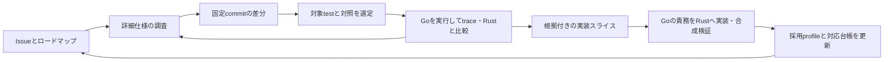

# TypeScript 7以降のテスト構成と継続追従

状態：2026-09-17のユーザー方針を受けた設計案。emitter完成を次の区切りとし、
その後のTS7移行・新機能追加・LSP/API移植に共通の追従手順を用意する。
ユーザーが指定した到達点は、Issue等のロードマップ調査から、詳細仕様・実行trace・
テスト比較・slice作成を経て、必要なGo実装をRustへ移すところまで。
今回の変更は文書のみ。以下の継続調査・差分分類・Rust比較・依頼生成の自動化は未実装。
配置案は、最初の実装スライスで小さな実例に当てて確定する。

前提は[TS7の方向](typescript-7-direction.md)、
実装済みの入口は[固定参照の実行手順](typescript-7-workflow.md)、
実行順は[emitter後ロードマップ](post-emitter-roadmap.md)、
最初の依頼案は[移行基盤batch](slices/post-emitter-foundation-batch/README.md)。
[残作業台帳](remaining-completion-slices.md)のIDと既存の完了記録を引き継ぐ。

## 参照は7.1、実装は既存機能の不足を優先する

2026-09-17、ユーザーは7.0までの不足解消を先行する方針を示した後、APIの変更を考慮して
7.1を起点にする案を提示した。以下はその追加提案と上流調査に基づく推奨案である。
**emitter完成後は7.1の固定commitを設計・比較の共通参照にし、実装順は7.0以前からある
機能の不足を優先する。** API/LSPの設計には7.1の契約と、そのために必要な依存を最初から含める。
7.1の追加言語機能・lib更新は依存と優先度で後続batchへ分ける。
現在のemitter完了条件、LSP/APIなどの製品別の完了判定、accepted profileの更新は別管理する。

起点にするロードマップはユーザー指定の
[TypeScript 7.1 Iteration Plan #63703](https://github.com/microsoft/TypeScript/issues/63703)。
2026-09-17に本文を確認し、Issueはopen、更新日時は2026-09-12T18:40:54Zだった。
言語・lib、API安定化、editor/LSP、性能、基盤の各項目から関連Issue/PR、固定source、testへ進む。
[API feature roadmap #63875](https://github.com/microsoft/TypeScript/issues/63875)も併用し、
新規APIの設計依存と、既存機能のRust側の不足を対応付ける。

### 7.1を参照にする根拠と確認の範囲

[7.0の公式発表](https://devblogs.microsoft.com/typescript/announcing-typescript-7-0/)は、
7.0製品にAPIを同梱せず、新しいAPIを7.1で提供する予定だと説明している。
Goの7.0 sourceに実験的なAPI実装があることと、7.0製品の公開API契約は区別する。
後続APIを7.1の設計から始めることで移植のやり直しを減らせる、というのが今回の判断である。

既存調査pin `1f70213d4922b434345f639b441681e470c7cfc1`（`7.1.0-dev`）と、
[`v7.0.2`](https://github.com/microsoft/TypeScript/releases/tag/v7.0.2)の
`1e4744d68260a7cb91b62b12edc3f6a2187faaf1`について、
[`tsc/internal/api/proto.go`の7.0側](https://github.com/microsoft/TypeScript/blob/1e4744d68260a7cb91b62b12edc3f6a2187faaf1/tsc/internal/api/proto.go)と
[7.1側](https://github.com/microsoft/TypeScript/blob/1f70213d4922b434345f639b441681e470c7cfc1/tsc/internal/api/proto.go)の
Method定数を静的に照合した。7.1側で31名の追加、3名の削除があり、追加には
`createProgram`、`transpileModule`、`transpileDeclaration`、emitと設定処理のAPIが含まれる。
原本SHA-256は7.0側 `5cf38a8dbc87c3f2b5032e9362cefd19dde703d9c9bf3063b2789bb1d5ffea19`、
7.1側 `102c2bb8f82b4afc8980f2984ade731fbf97a454371fff064906ffa0f64f59ce`。
これは宣言名の比較であり、31機能の完成、公開互換性、実行traceの証明ではない。

[Build Orchestrator API #64158](https://github.com/microsoft/TypeScript/pull/64158)は、
7.1でのbuild用APIとclient側のhost責務を扱うが、確認時はopen・未mergeだった
（head `24144e9f6a11f0d66a4055f368e923581424a854`）。
計画・開発中・固定pinに実装済み・採用済みを分け、未完成部分には既存の部分実装ルールを適用する。
参照開始時にはIssue本文と関連PRの更新を再確認する。

### Language Service APIの完成度

#63703のLanguage Service APIはリンクのない項目であり、空欄だけから未実装とは判定しない。
#63875の項目5では、公開するLanguage Serviceメソッドがまだ残っていると説明されている。
2026-09-17に取得したmain `5c2f7abf1733c9148100c5c6c7dd284745120d6b`の
[非同期clientのLanguageService class](https://github.com/microsoft/TypeScript/blob/5c2f7abf1733c9148100c5c6c7dd284745120d6b/packages/typescript/src/api/async/api.ts#L1034)
には、constructorを除いて5つのasyncメソッドがあり、補完、参照シンボル、import編集などを公開している。
これはこのclassの静的な宣言確認で、API全体の分母や実行検証ではない。
7.0で提供されたLSPのエディター機能、Go内部のLanguage Service、外部プログラム向けAPIは
別の契約として棚卸しする。現状は公開APIの整備途中として扱い、固定pinで動く部分から
調査・移植し、追加メソッドや未確定の契約は関連Issue/PRとともに再調査待ちへ残す。
この追加読解pinを既存helperやaccepted profileへ採用したわけではない。

### 台帳と比較基準

機能台帳には、導入された世代（7.0まで / 7.1以降 / 未確定）と根拠、7.1での仕様変更、
API/基盤の依存、実装優先度、上流完成度、Rust採用状態を別々に保存する。
7.0以前の機能も7.1側の対象挙動とtestへ対応付け、廃止・変更されたものは移行表に残す。
7.0の固定参照は導入時期や変更理由の比較に使い、7.1 pinでの成功を7.0互換の証拠にはしない。

後続調査は既存の7.1開発pinを起点にできる。各sliceでは対象のAPI/言語機能が入った
具体的なcommitとtest/lib/clientを固定し、releaseとの対応・未完成範囲を明記する。
既存のaccepted profileは6.0.3のままで、7.1参照の採用や不足一覧の実測はまだ行っていない。
今回の変更は設計方針の整理であり、helperのpin変更や7.1全体の互換性宣言ではない。

## 目指す作業の流れ

新しい上流コミットを見つけるたびに、調査から移植までをやり直さずに済むようにする。
半自動化は、決定的に実行できる収集・比較ツールと、Codex/Claudeによる詳細調査・
実装を組み合わせる。調査の粒度は従来の`_tsc.js`調査と同じに保つ。

| 順序 | ユーザーが指定した手順 | 保存する成果物 |
| --- | --- | --- |
| 1 | Issue等でロードマップを調べる | Issue/PR/Discussion/milestone、提案・実装・releaseの状態、関連項目と更新日時 |
| 2 | 仕様を詳細に調査する | 対象と非対象、構文・option・診断・出力・APIの条件、例外、依存、未決事項の根拠 |
| 3 | 上流差分を検出する | 固定commit間の実装・test・baseline・lib・protocol・harness差分と機能の対応 |
| 4 | 対象テストを絞り込む | 対象の全設定、隣接対照、操作列、期待値、選択理由と未観測の仕様条件 |
| 5 | テストを比較する | 新旧Go/Rustの観測、実行trace、分岐・状態変化・結果の対応、差の原因 |
| 6 | 実装スライス案を作る | Go ownerとRust owner、依存、変更対象、固定witness、実装手順、終了条件 |
| 7 | 必要に応じて本家Goの処理をRustで実装する | 原因に対応した実装、focused検証、複数項目の合成検証、採用範囲と残項目 |

2〜5は往復する。コード読解で立てた仮説を対象testの実行traceで確かめ、未解決の条件が
見つかれば仕様調査とtest選定へ戻る。slice案の生成だけでは一巡完了としない。



機能の追加だけでなく、不具合修正、既定値・診断・libの変更、廃止、テスト/harnessの
変更も追跡する。リリース告知やPRラベルは分類の手掛かりに使い、網羅性は固定した
Git差分とテスト台帳で確認する。分類できない項目は未分類のまま残す。

## ロードマップと仕様の調査

調査源は公式Issue/PR/Discussion、milestone、release資料、固定source、testとする。
予定・提案、PRでの実装中、merge済み、release済みを分け、Issueのcloseだけで採用可能と
判定しない。古い説明と最新の実装が異なる場合は、差異と採用する根拠を記録する。

2026-09-17の入口調査では、[API feature roadmap #63875](https://github.com/microsoft/TypeScript/issues/63875)
がopenで、milestoneはTypeScript 7.1.0 Betaだった。旧`typescript-go#4830`の移管先でも
あるため、旧repository/番号も対応付ける。この一覧はAPI機能の調査入口として使い、
各項目の実装済み範囲は個別のPR、固定source、testで確認する。
[Build Orchestrator API #64158](https://github.com/microsoft/TypeScript/pull/64158)は同日時点で
open・未mergeだった。こうした項目は計画へ取り込み、accepted behaviorとは区別する。
これらは今回の入口確認であり、各APIの詳細仕様調査が完了したという記録ではない。

Issue本文・設計に関係するコメント・関連PRも更新されるため、Git差分とは別に、URL、
取得日時、更新日時、内容hash、関連PRのhead SHAを記録する。前回からの更新を調べ、
取得失敗や未読の関連資料を残す。提案段階の項目はGo実装がまだなくても台帳へ載せ、
実装trace可能になった時点で調査を進める。

詳細仕様では、入力条件ごとの挙動、既定値、error/回復、順序、位置単位、identity、
所有権と寿命、cache/再利用、取消など、対象機能に関係する条件を整理する。
関数名の対応表だけで終わらせず、Goで何を決定し、どの状態を作り、誰が消費するかを
追う。上流にtestがない条件は不足として記録し、固定Goの実測に基づく補助probeを作る。
補助probeは公式testと区別し、両者を実装sliceへ引き継ぐ。

## 上流の構成に合わせる単位

調査参照は`microsoft/TypeScript`の
`1f70213d4922b434345f639b441681e470c7cfc1`（`7.1.0-dev`）。
以下はこのcommitのソース確認であり、全テストの実行結果ではない。

| テスト群 | 固定参照の配置・形式 | Rust側へ引き継ぐもの |
| --- | --- | --- |
| compiler / conformance | `tsc/testdata/tests/cases/{compiler,conformance}/`のTS/TSX入力 | 仮想ファイル、tsconfig、symlink、全オプション組合せと対応する期待値 |
| transpile | `tsc/testdata/tests/cases/transpile/`と対応するrunner | compilerと別のAPI呼出し・結果境界。現helperの対象外 |
| Language Service / FourSlash | `tsc/internal/fourslash/tests/*_test.go` | 入力、marker/range、編集・問い合わせ・assertionの順序、能力設定 |
| build / watch / project / LSP | 各`tsc/internal/`packageのGo test | 複数回の状態遷移、イベント、時計、要求・通知・応答など、そのrunnerの観測 |
| compiler API / client | `tsc/internal/api/`、`tsc/internal/ipc/`と`packages/typescript/test/` | Go側の契約と実際のclient呼出しを分けて対応付け。非同期JSON-RPCと同期MessagePackも別profile |
| baselines | `tsc/testdata/baselines/reference/`の各テスト群 | 元の相対パス、内容、生成元test/configuration。直接assertionだけのテストも台帳に含める |

上流の[compiler runner](https://github.com/microsoft/TypeScript/blob/1f70213d4922b434345f639b441681e470c7cfc1/tsc/internal/testrunner/compiler_runner.go)は、
入力から設定別testを作り、一部の入力を実行対象から除外する。
ファイル数、設定数、実行されたtest数、対応機能数は別々に集計する。
オプション定義やharnessが変わると、同じ入力でも設定展開が変わり得る。

例えば[FourSlashのBasicEdit](https://github.com/microsoft/TypeScript/blob/1f70213d4922b434345f639b441681e470c7cfc1/tsc/internal/fourslash/tests/basicEdit_test.go)は、
markerへ移動し、文字を挿入した後で補完結果を検証する。
Goファイルの文字列部分だけをTS入力として取り込むと、この検証は失われる。
操作列をRustのdriverへ対応付け、未対応の操作やassertionがあれば明示的に未対応とする。
Goテストの自動翻訳率を、Rust製品の互換率として扱わない。

### 配置の案

上流入力は元の相対パスを保ち、Rust固有のテストdriverは既存の`crates/*/tests/`に置く。
新しいテスト群を旧6系のディレクトリへ無理に変換する処理を増やさない。
次は未作成の配置案であり、現行helperのパスやCLIの説明ではない。

```text
vendor/typescript-native/<profile>/
  manifest.json                    # repository / commit / layout / toolchain
  cases.json                       # upstream test/configurationとRust driverの対応
  transitions.json                 # 前profileとの移動・廃止・採用の対応
  upstream/tsc/testdata/tests/...   # 採用する入力を元のパスで保存
  upstream/tsc/testdata/baselines/reference/...
  upstream/tsc/internal/...         # 採用するGo testの原本
  upstream/packages/typescript/test/...
crates/<owner>/tests/               # Rustの実行・比較driver
target/typescript-native/<commit>/  # 上流の実行用checkout、cache、調査log
```

取り込む原本は内容hash、取得元commit、licenseとともに固定する。共有helper、lib、
設定、生成物など必要な依存もmanifestで特定する。上流全体を毎回vendorへ複製するかは
別途容量を測って決め、初期実装は選択したtest群から始める。
採用証拠は既存のslice記録にも保存し、消去可能な`target/`だけに置かない。

layout adapterがこの構成を読み、runnerへ渡す。上流で配置やharnessが再変更された場合は
adapterのversionを更新する。未知の配置・テスト群を旧ルールで読み飛ばさず、
inventoryの不足として報告する。既存6.0.3の入力・証拠の移動は今回の設計に含めない。

## 参照と結果の管理

三つの役割を分ける。

| 参照 | 意味 | 更新方法 |
| --- | --- | --- |
| accepted profile | Rustが対応を主張するバージョンと範囲。現compilerは6.0.3 | 機能・廃止・既知差分の移行表と合成検証を付けて更新 |
| tracking checkpoint | 差分調査を記録済みの上流commit | 変更項目を未分類も含め台帳へ保存した時点で進める。実装待ちは消さない |
| candidate commit | 今回調査・比較する上流commit | branch名/tagを解決した完全SHAで固定。調査中に追従させない |

最初は現在のnative調査pinをinventoryの起点にする。そこからの差分だけでは6系から
TS7への移行分を網羅できないため、VER1.0-MAPで起点以前の機能・意図的変更も棚卸しする。
この起点より前からある不足も、7.1側の仕様・testとRustの対応表で調べる。
7.0の固定参照は導入時期と変更理由の比較に使い、7.1の実行結果と混同しない。
tracking checkpointを進めることと、accepted profileを更新することは別の操作になる。
差分検出を理由に既存の未対応行や合格基準を消さない。

比較はバージョン番号だけでなく、比較元・比較先の完全commit SHAを固定する。

| 調査 | 比較する組合せ |
| --- | --- |
| 上流の継続追従 | 前回調査済みのGo commit Aと今回の候補B。関係する実装・test・共有依存を比較 |
| 個別機能の深掘り | 関連PRの変更前後のcommit。PRが更新された場合は新しいhead SHAで別の調査記録を作る |
| Rustへの移植 | 対象Go commitとRustの作業commit。必要に応じてRustのbaseも同じ入力で比較 |

初回の6.0.3からGo版への対応付けは、機能・関数の責務・testを軸に行う。
言語と配置の違いを考慮し、単純なファイル差分だけで変更範囲を決めない。

一つの観測は少なくとも以下を持つ。

- repository、完全commit、元の相対パス、test名、設定、family/layout version。
- 原本・依存・期待値のhash、runner/toolchain、Rustの実行commitと変更状態。
- 実行command、観測境界、選択したIDと実際に実行されたID、結果とlog。
- 移動前後の対応、機能ID、実装owner、依存、採用状態と判断根拠。

同名ファイルやbasenameだけで同一視しない。rename検出は対応候補とし、testの分割・統合や
操作列の変更を確認する。現helperは一意なbasenameを要求するため、pathによる選択は
将来の拡張項目とする。

結果は`pass / fail / skip / omitted / unsupported / not-run / harness-error`を区別する。
Goの終了codeが0でも、選択したtestの未実行やbaselineの`.delete`を成功に含めない。
Go参照の成功だけではRust互換性は未確認であり、Rust側のdriverがない群は`unsupported`
として残す。rawなprotocol記録に含まれる動的IDなどは、契約で定義した対応だけを比較時に
適用し、結果の順序・span・内容・lifetimeの違いを一律に正規化しない。

## 上流で実装途中の機能

2026-09-17の追加合意：調査pinに機能の一部だけが入っている場合は、機能単位で
上流の完成度とRustの採用状態を分けて管理する。次の状態名・記録項目は今後の台帳設計に
含める要件であり、機械schemaや追跡処理はまだ実装していない。

| 軸 | 状態と判断の根拠 |
| --- | --- |
| 上流 | 提案中 / 実装途中 / 固定pinで対象範囲を確認済み / 取り下げ。仕様条件ごとのsource、test、実行traceと残りの関連PRを根拠にする |
| Rust | 未着手 / 調査中 / 実装中 / 検証済み / 採用済み。対象scopeと依存、無加工Goとの比較、必要な合成検証を根拠にする |
| 再調査 | 関連資料や実装の更新で再確認が必要になった項目を記録。過去の固定pinでの証拠と採用履歴を保持し、新候補で使える根拠を再評価する |

各機能には、仕様条件と必要な構成要素、pinごとに観測できた範囲、不足・未確定の条件、
関連Issue/PR、最後に調べたcommit、次の再調査条件を保存する。parser/checker/emitter、
API/client等にまたがる機能は、必要な構成要素とその依存を明示する。
Issueのclose、PRのmerge、選択testの成功だけから、機能全体を確認済みに進めない。

途中のpinでもGoのsourceを読み、動く範囲で実行traceを保存する。未実装や未観測の範囲は
そのまま記録し、原本の結果・不足の原因・比較可能性を分ける。Go側の未完成をRustの
不具合や互換成功に数えない。既に採用した範囲のRust退行は、通常の不具合として扱う。

取り込みは次のように分ける。

- 必要な依存が揃い、独立して利用できる部分は、その範囲と未対応範囲を明示して採用できる。
  採用時にはVER1.0-MAP/PINの移行表と対象profileの検証を揃える。
- 後続処理に依存する部分は、基盤の先行移植・内部検証として進め、機能全体の完了は保留する。
  公開範囲へ影響する場合は、その影響も既存の合格基準で検証する。
- 仕様や依存が未確定なら、調査結果と不足条件を保存して上流を追跡する。
  未確定の挙動をGoの完成仕様として補完しない。

例えば、構文解析だけが入ったpin A、型検査が加わったpin B、emitまで揃ったpin Cという
仮想例では、Aでparserの責務を調査・先行移植できる。Bでは型検査との接続とparserへの
影響を再調査し、Cでは一連の出力と隣接条件を検証して採用範囲を判断する。
独立したparser用契約の採用と、言語機能全体の対応完了は別に記録する。

### 再調査を起動する条件

関連Issue/設計コメントの変更、PRの新head・merge・取り下げ・revert、関連する実装・
test・baseline・lib・protocol・harnessの変更を検出したら、同じ機能IDの再調査候補へ戻す。
Git差分がなくても仕様説明の更新を対象にする。イベントの重複から同じ未完了項目を
増やさず、変更理由を既存項目へ追記する。取得失敗は未確認として残す。

再調査では候補commitを固定し、前回pinからの差分と不足条件を照合する。
仕様資料だけの更新なら同じcommitでも再調査し、資料の取得時点と内容hashを別に記録する。
対象testを選び直し、影響するGoの実行経路・状態とRustの観測を再確認する。
変更の影響がない証拠は根拠を付けて再利用し、旧traceを新pinで実行した結果にはしない。
上流の仕様変更やrevertがあればsliceと採用候補も見直す。tracking checkpointが先へ
進んでも、この機能の不足条件と再調査待ちは残し、accepted profileは採用手順で更新する。

## Goを実際に動かして調べる手順

従来の`_tsc.js`で行ってきた「原本を読む → probeを置く → 対象入力で実行する →
判断と出力の因果関係を確かめる → Rustの責務へ対応付ける」をGoでも行う。
機能移植の調査には、対象挙動の実行traceを含める。静的読解だけの項目は調査途中とする。

1. 調査commit、原本hash、toolchain、入力と全設定を固定し、無加工Goで結果を記録する。
2. CLI/API/LSPまたはtest runnerの入口から対象producer、共有helper、consumerまでを
   source上で追い、Rust側の現在の呼出し・状態管理との対応を作る。
3. 対象file・node/span・操作だけに絞ったprobeを置き、呼出し順、分岐条件、入力/戻り値、
   flagsとmetadataの設定・消費・解除、必要なcacheやsnapshotの変化を記録する。
4. 実際の対象testと隣接対照を実行し、Goのどの分岐が差を生むか確かめる。
   新旧の差を調べる場合は両commitで同じ観測境界を使い、比較不能な条件も記録する。
5. 同じ境界でRustを観測し、欠けた責務、誤った条件、状態の寿命、既存処理で再利用できる
   部分を特定する。関係するGo関数・分岐ごとに実装/再利用/対象外の根拠を残す。
6. probeのpatch、実行command、raw trace、差分、因果関係の説明を保存し、probe適用前・
   適用中・除去後の結果を比較する。実装後の互換性は無加工Goでも再確認する。

printとstack記録を通常の入口とし、step実行や複数goroutineの調査が必要ならDelveを使う。
probeは計算済みの値を読み、観測のために新たな型計算やcache更新を起こさない。
LSP/APIの通信stdoutにlogを混ぜず、stderr等へ分ける。pointerや一時IDはrun内の関係を
追うために使い、Go/Rust間ではsource位置・役割・寿命などの意味で対応付ける。
traceの一致は外部出力・protocol互換性と別の証拠で、計測による時間差を性能証拠にしない。

この入口は一から作る必要はない。[既存のprint debugging手順](typescript-7-workflow.md#print-debugging)と
`scripts/typescript7-check-this.patch`があり、2026-09-07の記録ではGo checkerにprobeを
置き、対象testの実行とstack取得、除去後の再実行まで確認している。
今後はこの深さの調査を機能ごとの標準手順へ広げる。今回の文書更新では新たなtraceを
実行しておらず、既存のcheckThis用probeを別機能の調査済み証拠には使わない。

## 半自動化する処理

| 段階 | ツールが作るもの | 実装・統合担当が確定するもの |
| --- | --- | --- |
| ロードマップ・仕様 | Issue/PR等の更新と関連資料を収集し、機能ごとの調査記録を生成 | Codex/Claudeが条件・依存・未決事項を原本まで調べ、根拠を確定 |
| 発見 | 旧・新commit間の変更一覧、test/baseline/実装/option/lib/protocol/harnessの関連候補 | 機能追加、不具合修正、意図的変更、廃止、移動、基盤変更などの分類 |
| 対応付け | 原本パスとtest IDの差分、既存Rust driver、未対応操作、関連する残作業 | 変更の意味、producerと依存、比較すべき観測境界 |
| trace・比較 | 隔離したGo probeの実行とlog保存、新旧Go/Rustの結果・設定・未実行の差分 | Codex/Claudeが実行経路と状態を追い、差の原因、Go/Rustの責務を確定 |
| 依頼案 | 根拠リンク、固定test群、担当候補、依存、変更対象、検証command、終了条件 | 実装可能なsliceへの調整、優先順位、同時に統合する組合せ |
| Rust実装 | 調査記録・trace・testを作業branchとsliceに引き継ぐ | Codex/Claudeが必要なGoの処理をRustの既存設計へ移し、focused検証と隣接退行を確認 |
| 採用 | 実装後の比較reportとprofile更新案 | 合成検証を確認し、既存の統合手順で採用 |

差分選定には変更されたtestだけでなく、共有harness、option metadata、lib、protocolの
変更が影響するtest群も含める。影響範囲を特定できない場合は未選択を成功扱いせず、
該当群の検証を広げる。定期調査の予算を超えた分は未実行として次回へ引き継ぐ。

比較では「旧Go → 新Go」の変化と「Rust → 採用候補Go」の差を分ける。新規testは旧版で
動かない場合があり、構文・option・harness非対応を旧版のsemantic failureに数えない。
Rustの退行判定には、必要に応じて同じ入力でRustのbaseとcandidateも比較する。
上流の期待値変更だけから新機能完成やRust退行を決めない。

上流参照testは原本のrunnerで実行する。任意commitを扱う拡張ではcheckout・baseline出力を
分離し、同一checkout内は直列実行する。採用するRust driverは必要な設定・操作を再現し、
診断、出力、問い合わせ結果などの契約ごとに比較する。
FourSlash全体を初手で共通DSLへ変換する必要はなく、対応する操作から段階的に広げる。

既存`scripts/typescript7.py`の固定pin、選択、実行log、skip/omission/difference検知を
再利用する。現在あるcommandは`setup / build / compiler / fourslash`のみで、
上記inventoryや任意commit比較commandはまだ存在しない。
実装時は同じ責務のrunnerを別系統で作らず、必要な参照選択とadapterを追加する。
baselineの自動acceptや、上流リポジトリへのissue/PR投稿はこの処理に含めない。

## 最初の実装スライスと担当

emitter後、まず以下の1・2を一つの実装batchにし、次に3・4と一件の機能移植を組み合わせる。
意味のあるfocused検証を実装中に行い、関連項目がそろってから一回のhosted検証へ進める。
これは基盤を作る順序であり、半自動化の到達点を調査reportだけへ縮めるものではない。

| ID | 成果物と終了条件 | 依存・担当 |
| --- | --- | --- |
| VER1.0-SYNC1 | 固定commitのlayout/inventoryと元パスを保つimport manifest。compiler設定、FourSlash操作列、API client群を別々に表現し、重複・未知・除外を検出 | 既存native workflow。Codexが基盤・既存harnessとの接続を担当 |
| VER1.0-SYNC2 | ロードマップ資料の更新、詳細仕様、固定commit間の差分を機能台帳へ結ぶ。導入世代と根拠、7.1の仕様変更とAPI依存、実装優先度、上流とRustの状態、不足条件、関連PR、再調査条件を分け、追加/削除/移動・baselineのみ・共有依存変更も残す | SYNC1。Codex。MAPへ接続。既存機能の不足を優先し、7.1のAPI/基盤依存と追加言語機能を区別する。再実行・重複イベントでも同じ機能IDを使い、checkpoint更新後も未完了項目を保持 |
| VER1.0-SYNC3 | 選択したnative compiler testでGoの実行traceと新旧Go/Rustの比較を一巡。Go/Rustの責務、全設定・欠測・上流未完成・旧版非対応・baseline削除を区別し、更新で影響する既存観測も再確認 | SYNC1/2、対象のRust観測driver。Codex。FourSlash/APIの実行対応はL3/API1/L5の実装に合わせて追加 |
| VER1.0-SYNC4 | 詳細仕様・trace・比較から担当別sliceと合成検証案を生成。独立した部分採用、基盤の先行移植、上流待ちを分け、原本・owner・依存・command・終了条件を引き継ぐ | SYNC2/3。Codexが生成・統合を担当。Claudeへは依存が閉じた機能群をまとめて渡す。公開範囲の採用はMAP/PINと既存readinessに従う |
| VER1.0-FEATURE-PILOT | 台帳の既存機能の不足から限定した一件を選び、手順1〜7を通して必要なGo処理をRustへ実装し検証。対応済みならその根拠を残し、別の既存機能の不足で実装工程も確認する | SYNC1〜4と該当producer。Codex/Claudeが実装、Codexが統合。調査開始時に7.1の対象commit・仕様・testと上流の完成範囲を特定する |

生成物は既存の[slice packet手順](slices/README.md)へ接続する。
原本・Go/Rustの現行symbol・trace・期待値・依存が揃い、適用するreadiness検証を通った
sliceを実装する。根拠が不足する案は`research`として次の調査を続ける。
Goの処理は条件・順序・所有権・寿命をRustの既存構造へ対応付け、表面的な構文変換で
完成としない。関連する複数sliceの変更を合成してから、既存の統合手順で採用する。

pilotの入力例は、設定展開がある`deleteExpressionMustBeOptional.ts`、操作列がある
`TestBasicEdit`、`packages/typescript/test/async/api.test.ts`のinventoryとする。
これは追従手順の試験材料であり、それらをTS7の新機能や実装済みAPIとは呼ばない。
差分処理には二つの実在commitを選び、変更理由と対象testが確認できる小さい範囲で試す。
rename、選択ゼロ、skip、未知layout、同じ入力の設定変更なども小さな対照例で確かめる。
上流の部分実装から後続実装・仕様変更・revertへ進む対照例も用意し、未完了項目の保持、
再調査の選定、重複通知の集約、旧証拠の保存、部分採用と全体完了の区別を確認する。
これらはSYNC2〜4で実装・検証する条件であり、今回の文書更新で実行したtestではない。

最初は任意のタイミングで手動起動する。安定した後、週次または上流release検知で
reportを生成する運用を追加できる。定期処理の設定はまだ行わない。
新機能は`VER1.0-FEATURE-*`へ依存順に分配し、未実装/実装中/検証済み/採用済みを管理する。
台帳の追跡範囲は7.0に限定せず、7.x以降にも同じ手順を適用する。
参照versionと実装順は区別する。7.1を共通参照に、既存機能の不足と必要なAPI/基盤を先行し、
追加の言語機能・lib更新は依存と優先度で後続batchへ分ける。

固定commit間の比較と上流の部分実装に関する追加合意も、この設計とSYNC2〜4の
終了条件へ反映した。半自動化本体の実装順は引き続きemitter完成後とする。

## 今回確認した範囲

固定参照のGit tree、compiler runner、BasicEdit、API client test、`tsc/CHANGES.md`、
既存helper・probe・workflowと、公式APIロードマップIssue/関連PRの状態を確認し、
この設計案と残作業台帳を更新した。
今回の上流build/test・新たなGo trace、Rust比較、新機能の網羅的な仕様調査、
テスト配置変更は未実施。
この文書をemitterの新しい終了条件には加えない。
後続の方針更新では#63703とAPIロードマップ、7.0の公式発表、固定した7.0/7.1のAPI宣言を
確認した。7.1を参照に既存不足を先行する推奨案を記録したが、各機能の詳細な実行調査や
Rust実装、7.1全体の完成度判定はまだ行っていない。
